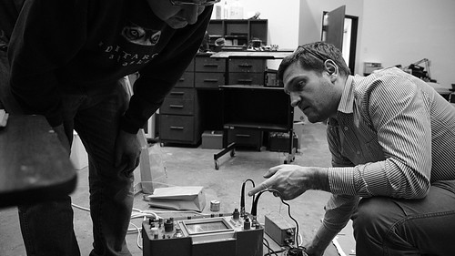

 Dallas Makerspace have some blog coverage of Gareth's visit to their space:

> [Gareth Edwards](http://wiki.edinburghhacklab.com/GarethEdwards) of [Edinburgh Hacklab](http://wiki.edinburghhacklab.com/) and [Dorkbot Alba](http://dorkbot.noodlefactory.co.uk/wiki) in Scotland is our latest international visiting hacker. He dropped by the Dallas Makerspace on Sunday (7 Nov) to check out our newly painted warehouse area and help us pull the plastic tarps off all our gear. Edinburgh Hacklab and Dorkbot have done projects similar to some of our own including a really cool [computer controlled pipe organ](http://www.youtube.com/watch?v=8R9lAIS1l4w) that puts our puny [vacuum reed organ](http://www.youtube.com/watch?v=st7uZdQfLMU) to shame.

[Read more](http://dallasmakerspace.org/blog/2010/11/gareth-edwards-of-edinburgh-hacklab/).
