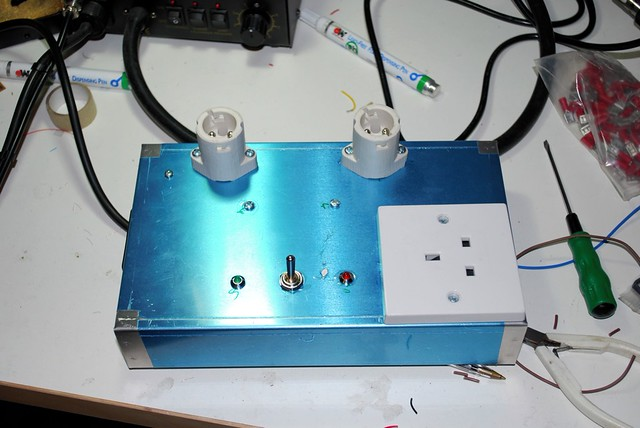
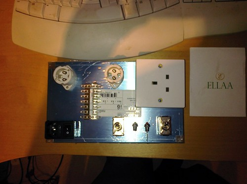
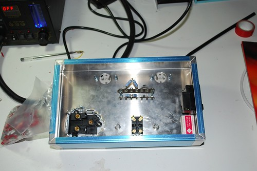
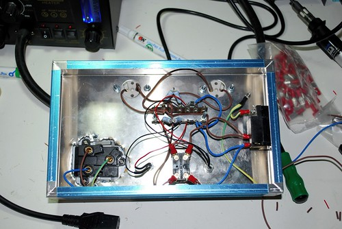

Last night we completed a vital new piece of equipment, the safety socket.

The safety socket is a design by Kevin O'Connor of [London Power](http://www.londonpower.com/ "London Power") that has been published in his book ["Tonnes Of Tone"](http://www.londonpower.com/catalog/product_info.php?cPath=3&products_id=11 "Tonnes of Tone"). It uses domestic light bulbs as a power soak to protect equipment-under-test in the event of a potentially catastrophic failure. It's a simple design that can save hundreds of pounds worth of gear from destruction.

Now it's completed, it becomes part of the growing library of test equipment available to builders and experimenters in the Edinburgh Hacklab.

Here are some images showing the construction process:

