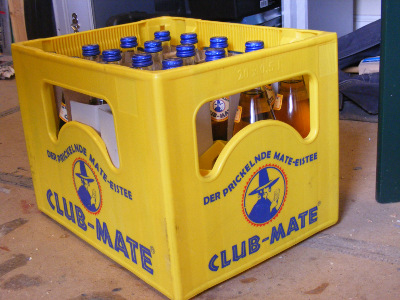
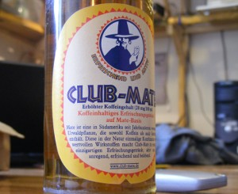

A delivery of [Club Mate](http://www.clubmate.de/cws/en/home.55.html "Club Mate") has safely arrived in the lab, complete in original yellow crates. A staple drink at European hacker camps and hacker-spaces, it's a caffeinated drink with less sugar than typical caffeinated beverages. Best severed chilled, the taste is often described as iced tea like.

 

If your in the lab and fancy trying a bottle help yourself, suggested donation of £2 into the glass on top on the fridge.

Many thanks to [Club Mate UK](http://www.clubmate-uk.com/) for supplying us.
