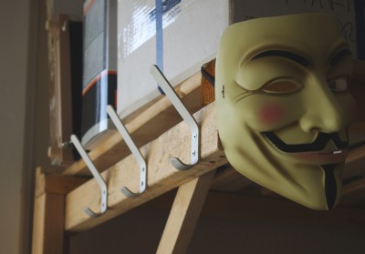

The hack lab equipment list is getting quite long, including:

- Tables, chairs & sofa - tick
- Soldering Irons - tick
- Microscope - tick
- Projector & Sound system - tick
- CNC Milling Machine - tick (Z axis TODO)
- Fridge (with Beer & Club Mate) tick
- Somewhere to hang your coat...... um ... back of a chair?, side of the sofa?

That is until now. We have coat hooks! Five of them in total, spread out around the lab.

