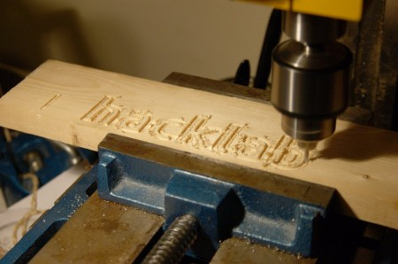

For those of you not following on the mailing list, this was the first live cutting done by our CNC mill conversion a couple of weeks back. Now we just need to complete the automation of the Z-axis, which is in progress.
