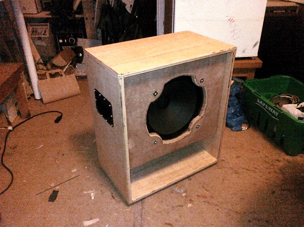

Made good progress on the speaker cabinet at the Hacklab last night, ably assisted by [@tinyblob](http://twitter.com/tinyblob). Unfortunately, the screws I bought for the back panel are a few mm too short so I need to do some shopping. Getting close now, though.

I still need to chisel out pockets for handles on the accompanying 4U rack box but that shouldn't take long.
