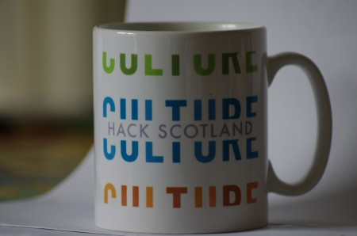

Organised by Edinburgh Festivals Innovation Lab, the first [Culture Hack Scotland](http://culturehackscotland.com/) event took place on 6/7 May. It brought together 50 developers & designers and 50 arts professionals for 24 hours of hacking and making. A number of the [datasets](http://culturehackscotland.com/about/data "datasets") were released specifically for the event, including footfall data collected across 19 locations in central Edinburgh.

It was great seeing designers and developers meeting with arts professionals,  that wouldn't generally happen. Hacking went on late into Friday night and continued on Saturday with lots of delicious food to sustain everyone.

Edinburgh Hacklab was represented with several members and regulars contributing to hacks, including:

Jane Mensch - [Fringemon](http://culturehackscotland.com/portfolio/fringemon) Fringemon is a social game for the Edinburgh Festival Fringe – help the critters make their way round festival venues using QR codes.

Peter J - [Festival Balls](http://culturehackscotland.com/portfolio/festival-balls-by-peter-jackson) A visualisation of daily footfall on the High Street during the Edinburgh Fringe/International Festival 2010 using an Arduino and RGB LEDs.

James ([@jarofgreen](http://twitter.com/@jarofgreen)) - [Festafriend](http://culturehackscotland.com/portfolio/festafriend-by-james-baster-sarah-drummond) Social networking for the fringe. A service to match people who might want to go to see the same shows. Ideal for taking  advantage of 2-for-1 offers and maybe enjoying a drink together afterwards....

[Showcase of all the hacks](http://culturehackscotland.com/showcase)
