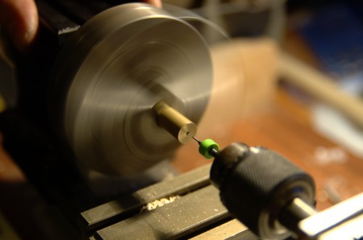
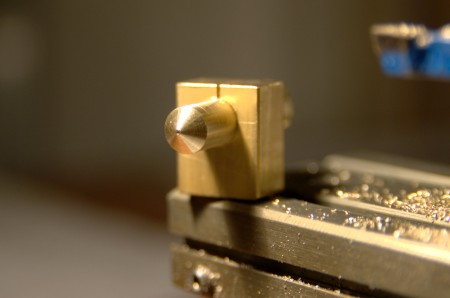

 

Stephen brought his lathe in to the lab so we could work on fabricating the "hot end" of a RepRap 3D printer, the part which melts and extrudes the plastic. The hot end parts are the awkward bits of the design, because they can't be 3D printed by another machine, or bought off the shelf as standard components. Even with the right equipment, these parts require some skill to make! Drilling the 0.5mm hole in the brass nozzle requires perfect centering of an extremely fragile drill bit:

Then the nozzle end needs to be turned off at an angle, matching the angle on the end of a drill, which will later be used to drill in from the other side to create the heating cavity. The whole piece is then turned down to fit a mounting hole in the heater block, which we made earlier on the mill:

The result looks pretty good! Next time we'll drill out the other side to create the heating cavity, and turn the insulating tube which fits on the back of the nozzle from heat-resistant PEEK plastic. If you're interested, the design we're making is [this one](http://reprap.org/wiki/Geared_extruder_nozzle#PTFE_sleeve_nozzle "PTFE sleeve nozzle").
