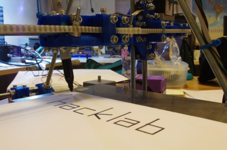

Here's the machine from March's RepRap build party, still lacking its extruder but joining our collection of robotic devices writing 'hacklab' at the lab. The machine belongs to Edinburgh University, but we're helping to get it up and running so it can print a set of parts for the Hacklab's own RepRap Mendel.

http://www.youtube.com/watch?v=TYxwO3Ut3i8
