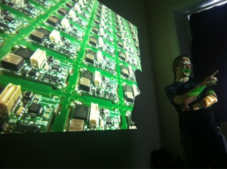

A quick thanks to everyone who came to the lab on sunday the 5th of June for our first set of organised talks.

We packed out the lab, it would've been a struggle to fit even one more person in. Martin and I really enjoyed giving our talks, and chatting with everyone afterwards. Thanks again to everyone who stayed back and talked to us, it was a great experience.

We've received some excellent feedback, and so far things seem to be pointing towards a definite possibility of another similar event in the future. Possibly on a larger scale, in a larger space than the lab itself. With more speakers and possibly a workshop or two.

If you're interested in attending future events please feel free to join our [mailing list](http://edinburghhacklab.com/contact/), where we'll be sure to post well in advance of any upcoming events. We'd also love to hear from anyone who's interested in running a talk, or has an idea for one.
