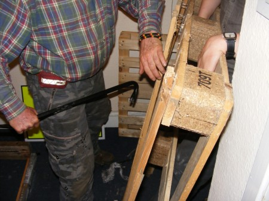

A team from Edinburgh Hacklab are taking part in the [Edinburgh Canal Festival Raft Race](http://www.edinburghraftrace.com/) this Saturday (9th July). Preperations have been taking place throught the week including designing the raft and sourcing materials. 

 The raft racing starts at Lemmington Bridge, Union Canal around 12.30pm if you fancy coming to watch. It should be fun whatever happens!
