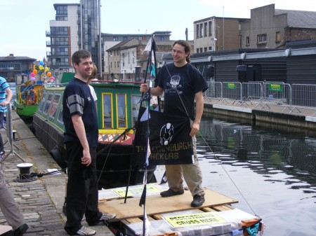
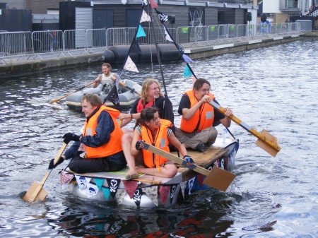
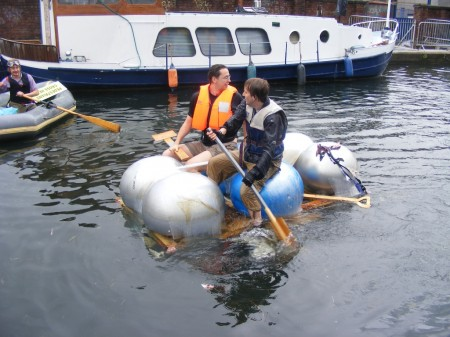

It was Saturday morning, following a late night of raft assembly and a tight fit into the transport the Edinburgh Hacklab raft was at the canal ready for racing. During some pre-race testing there was a capsize with the two occupants going for a swim. We went in the first heat against a very impressive raft built of thick plastic pipes and plastic containers. After an unsuccessful attempt to get 6 people on our raft, the crew was reduced to 4 (Gandolf, Martin, Tom D & Ceava). The raft made it to the finish at a steady pace with no mishaps, unfortunately behind the competition. 

As runners up we were to take up a place in the "plate race". By this time the rain was chucking it down, and with spectators rapidly leaving a decision was made by organisers to merge the plate race & final.

After a crowded and splashy start the hacklab raft started to fall behind. Whilst attempting some repositioning of the 3 crew there were "stability issues" resulting in a capsize. After a slightly "interesting" escape from under the capsized raft Peter requiring the services of the rescue boat, leaving Martin and Bart to continue. Unable to right the vessel they used it "upside down" and found it worked quite well](http://edinburghhacklab.com/2011/07/raft-race-report/dscf8521/)

Jane & Ceava took up an offer to crew a beautifully made raft using milk cartons for floatation as the original young Milk Carton Crew wanted a rest. They finished 4th whilst the hacklab built raft finished 5th. Smiling faces all round, despite being cold and wet.

Great to see lots of us getting involved in the design, collection/donation of materials, build and paddling. [Photos on Flickr](http://www.flickr.com/photos/greenhac/sets/72157627035977303/)

[Videos](http://www.youtube.com/user/TheEdinburghHacklab)

We are already talking about next years design....
