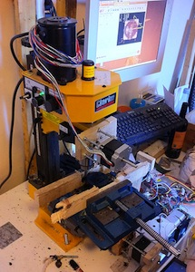

\[caption id="attachment\_452" align="alignright" width="215" caption="Sacrificial wood clamps the piece so the cutter doesn't hit the steel vice. We have a new cutting lubricant in the bottom of the photo. A bottle of red helps the time pass."\]\[/caption\]

Maria and I were working last week fabricating four identical complex pieces out of ABS plastic. Initially we though a lowish feed rate combined with a fast cutting speed would give the best results but actually that's not true. ABS suffers from the material melting and reattaching tangental to the circular cutter, so the effect is that when you cut, you end up drawing frayed lines over the surface. This is particularly noticeable on 90 degree corners and in deep pockets (concave regions). The first fix we tried was running the same program a second time. This did improve the situation but not enough to give it a finished look.

<!--more-->

After some research on the net it turns out that every material has a sweet spot, which is some arbitrary combination of adjusting the cut speed, cutter size, feedrate and depth of cut. As ABS has a low melting point you want to move \*quickly\* and try not to generate too much heat by cutting at a slower speed, higher torque. Our worst results ware gained by cutting at 200mm/minute with a 10mm cutter at ~2000 RPM (our top speed) cutting 5mm depth (quite deep but we try to keep the times to fabricate to under 2 hours). When we turned out feedrate rate up to our max of 450mm/minute, with an 8mm cutter and 4mm cutting depth we got pretty nice results first pass on facing operations. The program ran faster as well. However, the results were improved but not great inside deep pockets. Our vacuum cleaner does not have enough oomph to clear the ABS debris out the way, so deep pockets becomes a sea of ABS mush which is something we can't really do much about without an air gun or lubrication jet (i.e. money). Running the program twice helps again except we have an outstanding issue of Y slippage.

We found the Y axis had drifted about 1mm over the 45minutes of cutting time. I am unsure of the source of the problem. It could be, 1, friction in the Y is enough to skip a tiny, tiny fraction of some steps (slow acceleration?). 2, The computer is overloaded and messing a few signals up. 3, noise elsewhere. I was mucking about with Y torque and nearly overheated the motor, so the settings on the motor driver are a bit wonky. I am still not sure what the problem is, it might take a while to diagnose. Probably it is a mechanical problem but I could not be sure that the X axis wasn't drifting too due to the part geometry. If both are drifting its probably electrical/computer issues otherwise its probably y axis mechanical issues. I do not want to loosen the Y bearings though, because slop is an issue which amplifies vibration. Vibration is a major cause of poor results and a limiting factor in the speeds you can cut.

My proposed solution is that we add limit switches with can then be periodically used to reset the position integrator. That will require learning the distinctions of the different coordinate systems in EMC2. Its also worth being a bit smart about limit switch placement. You want the tool to move as little away from the piece being cut so it 1. does not waste time, and 2. does not get the opportunity to integrate errors in the travel time. Some cool machines on the net have adjustable limit switches. In these machines, some tabs can be put in different places on the worktable, and these break fixed IR beams. Our machine is ferrous, and I love magnets so magnetic tabs are my idea for being the beam breakers.

Hopefully with a good method of dealing with errors we might be able to do long cut times without babysitting the machine.
