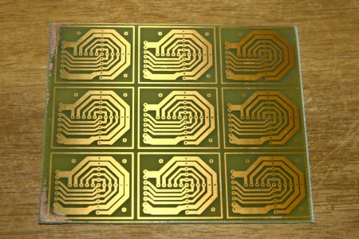

Our inhouse PCB manufacture is improving, with 100% yield of a prototype non polar data and power connector.  Results below.  Had to print exposure mask at 110% so that the printer printed at the right size.

\[caption id="attachment\_491" align="alignnone" width="450" caption="non polar 4 \* data and power connector"\]\[/caption\]
