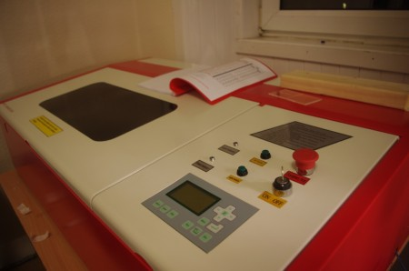
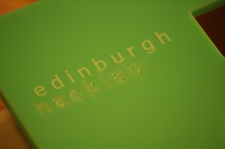

Edinburgh Hacklab is pleased to announce the arrival of a rather special bit of equipment, a laser cutter.

So what does one do with a laser cutter? It enables high resolution (0.0254mm/1000dpi) engraving and/or cutting of a wide range of materials including Acrylic, Crystal, Bamboo, Cloth, Fabric/Denim, Fiberglass, Glass, Laminated Plastic, Leather, Marble, Plastic, Paper, Rubber, Wood, MDF, Marble, Anodized Aluminum and Coated Metal.

After the initial setup was complete little time was wasted before lasering began!

Training for members will be taking place over the coming days and weeks, so expect to see some great stuff being made.

Enjoy the full installation process taking place in a time lapse video below.

<iframe width="560" height="345" src="http://www.youtube.com/embed/QQ4sKJW-6M8" frameborder="0" allowfullscreen></iframe>
