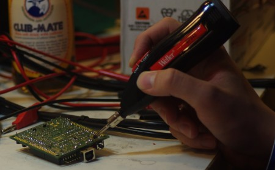

Our friends at [Farnell](http://uk.farnell.com/) recently sent us a [Weller BP645EU battery-powered soldering iron](http://uk.farnell.com/weller/bp645eu/soldering-iron-kit-battery-operated/dp/1229802) to play with. We put it to the test and here's what we thought...

The first impressions are good. It's a nice, simple, product: throw away the instructions, install three AA batteries, remove the cover, slide the switch to on and hold the button for (near)instant soldering gratification. After faffing about with butane irons it's a nice change. No lighters or gas refills required, no adjusting, just a single button. To quote a tortise: it's easily turn off and onable.

\[caption id="attachment\_540" align="alignright" width="450" caption="Iron in action soldering an LED onto a Nanode"\]\[/caption\]

It takes a few seconds to get to temperature and then the solder flows well (we tested with 60/40 solder because we're old school) and the tip works great. The warm up time is comparable with a butane iron but - and it's a big but - there's no locking switch. The button has to be held down for the iron to stay hot, if you let go to put the iron down to fiddle with the wires you're soldering you'll have to wait for it to warm up again. A hack in the form of a piece of sticky tape cross the switch would do the trick, but don't forget to switch off when your done!

We tested the iron on a couple of little jobs around the lab, I installed an LED onto Peter's Nanode and Tom L used it to bodge a new power supply into Martin's BBC Micro prior to the birthday do. It worked fine for the Nanode LED job though it took a while. Reading the side of the iron explained the time taken: "6 Watts". It took a while to get heat into the ground plane of the Nanode because of this. The iron struggled when Tom used it on the larger power terminals in the Beeb (he eventually moved onto a "proper" mains powered Weller iron (an antique, but similar [Weller irons can be found here](http://uk.farnell.com/weller/))).

The obvious use case is for jobs that would be a pain to do with a corded iron. It is ideal for car PC/stereo wiring, bike lights etc that sometimes need solding attention. It's likely to be used for tweaks to the Hacklab CNC mill which is on the opposite side of the lab to the soldering bench.

**Pros:** Easy, cheap, uses readily available AAs, very portable. **Cons:** Lacks locking switch, low power.

**Conclusion:** A good deal for the money, handy to have in toolbox for little jobs away from the mains. If you're near the Hacklab then feel free to give it a go on an open night and see what you think (it lives on the soldering bench)!
