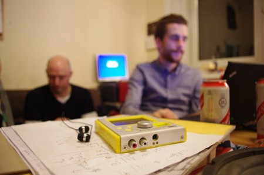
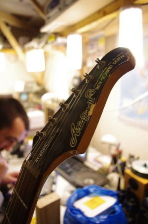

Okay, so I'm writing this with a bit of a sore head because we were hacking till gone midnight and I had to get up early the next day, but it was worth it.  Last night was the first in a monthly series of music hack nights at the lab, and it was crazy popular.  There were more people than chairs at some points in the night!

There was lots of talk, lots of playing with real and software instruments, some soldering, some embedded audio, and even some flashing lights.  Watch the video at the end of this post to get a feel for the vibe.  There was also discussion about ways to involve hacking with music, technology and performance.

Thanks to everyone who came along and made it a great night.  We're planning the next one for the 16th of December and we're hoping to do a jamming session.  [There's a public wiki for sharing our ideas right here](http://edinhacksounds.wikispaces.com/ "Hacklab Music Wiki").  Go there and add yourself to the People page, or to suggest things to do in December.  We'll argue about it nearer the time on the hacklab-discuss mailing list :)

<iframe src="http://www.youtube.com/embed/sRV6k0KBaz8" frameborder="0" width="560" height="315"></iframe>
