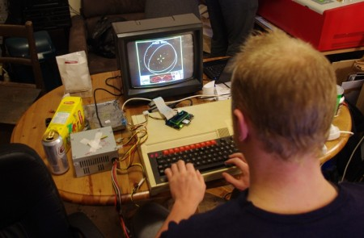
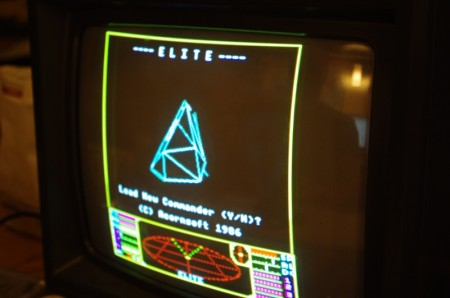

On a wet and windy night when anybody sensible would be staying inside, a few hardy individuals ventured out to the Hacklab to celebrate [30 years of the BBC Micro](http://www.bbc.co.uk/news/technology-15969065).

Several BBCs, now in Martin's possession, had made the trip north and after a bit of swapping of keyboards etc one was ready to go. The power switch was flicked followed by the classic bleep from the speaker.

Attempts to use a real floppy drive resulted in "funny noises" so a floppy disk emulator board with a 2GB SD card (probably enough to store every BBC title many times over) was used for storage. It didn't take long for classic titles such as Elite, Repton and Stryker's Run to be loaded up and played with enthusiasm.

<iframe src="http://www.youtube.com/embed/oCdgiaOFo84" frameborder="0" width="560" height="315"></iframe>

Many British children of the 80s and early 90s grew up around a BBC either at school or home if you were fortunate enough to have one. I remember school teachers' children (and often large group of friends!) would spend many hours on the BBC that had been brought home from school for the summer holidays.

The computing landscape has changed massively since the BBC was king.  Raw computing power many magnitudes more powerful than a "Beeb"  are now available for a fraction of the cost. However arguably computing has become less accessible with the complexity of many modern systems making it hard for a fledgling hacker to start their path.  Products such as [Raspberry-Pi](http://www.raspberrypi.org/) aim to encourage such learning but the fact remains that there won't be anything quite like a BBC again.

