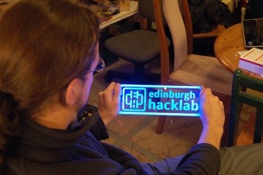
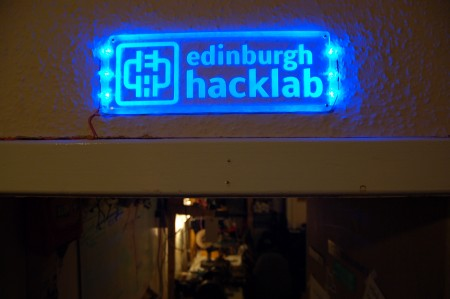

After a night of "prototyping" and filing LED ends flat we can proudly present:

Running from a 12volt rail of our wall mounted computer wall-e, vistors to the lab will be guided to our door. 6 LEDs sourced from Al's random stuff box are used for illuminations with a cunning resistor arrangement.

  

