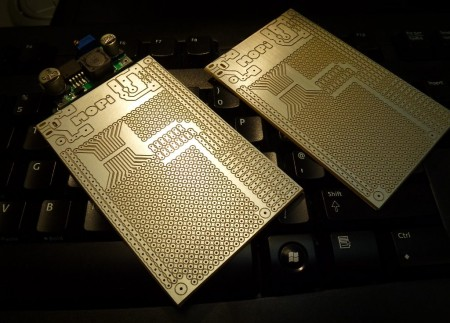

Its nearly RaspberryPi time!! I am excited. John Alexander of Shropshire Linux User Group has been developing a breakout board for it.

"This may be of interest to folks in Edinburgh. It's the first revision of our [prototyping board](http://shropshirelug.wordpress.com/2011/12/10/mopi-a-prototype-board-for-raspberrypi/) for the [RaspberryPI](http://www.raspberrypi.org/forum?mingleforumaction=viewtopic&t=1483.0#postid-20935) .

All the best John"

