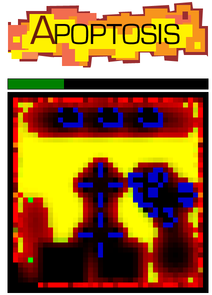

[Global game Jam](http://globalgamejam.org/) was held at [Napier University](http://globalgamejam.org/sites/2012/edinburgh-napier-university) for Edinburgh this year. I took part with one of my friends, Tom Joyce. We had previously taken part in a game jam before. The theme for the 48h game development event was a picture of a snake eating its tail laid out in a circle.

Our interpretation for the theme was the circle of life, but we also took more literal elements in the form of snake poison. Our game celled Apoptosis (official term for the cellular mechanism of programmed cell suicide) follows the journey of a poison acting on a body, at the cellular level (level 1), the arterial level (level 2) and organs (level 3). Hacklab is kindly hosting it [here](http://edinburghhacklab.com/GGJ2012/) (Chrome recommended).

<!--more-->

Tom and I's background is in artificial intelligence, and we produced a game typical for this niche. The main mechanism of the game using [Conway's game of life](http://en.wikipedia.org/wiki/Conway's_Game_of_Life), a cellular automata capable of complex behaviour from simple rules. What we added was an extra layer of cell types, blood, which followed diffusion dynamics and could be **displaced** by the game of life cells. This is really showcased well in level 2, where gliders actually pump the blood through the level. You can disrupt the glider flow and see the blood stops flowing through the long range blood pipe.

48h is not long enough to really play with the dynamics enough find out what other mechanism are possible with this hybrid cellular automata model. One fun thing we noticed is that some interesting structures are spawned when you place 8 or 10 elements in a straight line. In the prologue we included additional tools for the user to paint the canvas in different cell types. Furthermore the whole cell update mechanism is dynamically loaded from the interface found at the bottom of the page (very useful for developing the system live).

One of the main problems with the game of life is that it is exceedingly sensitive to perturbations. Many of the (young) game players at GGJ had not encountered Conway's game of life before so could not play our game in any sensible fashion! You need to spend time discovering recipes in order to get anywhere. Our staple structure is a 2x2 grid of cells which is stable under update. Its niche gaming to the max, which is probably why we finished 5th out of 7 :/ Those that liked our game though, **really** liked it though, and I expect the game to be quite compatible with many Hacklabbers tastes too.

It was interesting to see what the next gen game developers where using. By far the most used tool in the competition was the Unity framework, followed by Game Maker. A number of games managed 3D content. The obvious bonus of using a framework is that these tools provide level editors, something which we sorely missed in Apoptosis. That said, I glad we managed to produce a stand alone game in HMTL5 and javascript, as its much easier to distribute and thus has a better chance of being casually glanced at by people.

I had never programmed in Javascript before. As it turns out these are easy technologies to get hacking in (thanks to being scripted). I use GameJams as an excellent learning method for me to pick up new programming skills rapidly. By partnering with someone who already knew the programming language we were developing in, I always had an expert to consult on hand. He also programmed the initial lines of code, which is great to get the ball rolling in a new language, and obviously the competition itself gives a great target to aim for.

So I hope you enjoy [Apoptosis](http://edinburghhacklab.com/GGJ2012/) (comments below), and I hope you enjoy a GameJam in the future.

Tom
