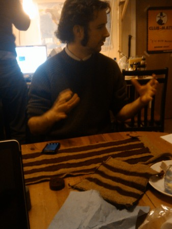

The hottest Friday night in Edinburgh, our monthly music event returned last week for more of the best in eccentric homebrew action. We saw Andrew Kieran's fabric potentiometers - hand-woven cloths designed to behave as electronic components - being used to control sequencers and to drive synths.

<iframe width="420" height="315" src="http://www.youtube.com/embed/iWAhYe3Q_H4" frameborder="0" allowfullscreen></iframe>

Andrew was good enough to explain some of the technology behind his creation, though sadly my phone was not up to the job of videoing much. Tom Hardiment demoed his arc tweeter, a speaker that emits sound by modulating a high-voltage electrical arc.

<iframe width="420" height="315" src="http://www.youtube.com/embed/shnogMxaa0c" frameborder="0" allowfullscreen></iframe>

Also, Ioann Maria brought a nostalgia trip in the form of an old Amiga 600 with Protracker in the disk drive. Naturally, after we'd worked out how to make it make noises we had to wire this to the arc tweeter. Tom Larkworthy wrote a whole set of strange and wonderful vocal modulations in SuperCollider.

A good time was had by all, the next one is on March 16th!

\[caption id="attachment\_709" align="alignnone" width="337" caption="Andrew with his fabric sequencer."\]\[/caption\]
