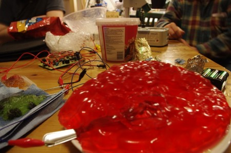
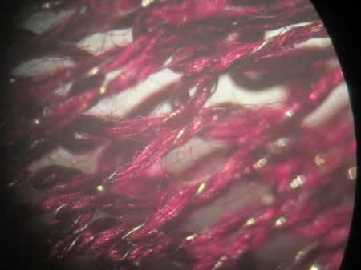

March music night once again was busy with some familiar and new visitors dropping by during the evening. Jelly was a predominant theme of the night, with James of Madlab & Matt bringing along Jelly Theremin and Drum kit. Andrew K and Tom H unveiled a project they had been working on together, a single string instrument built using a length of knitted conductive fabric. Gary brought along several OLPC laptops to demonstrate their musical abilities and for everybody to play with.  Tom L was coding something with a microphone connected to a laptop that reacted to singing and similar sounds!

<iframe width="420" height="315" src="http://www.youtube.com/embed/w_DP52PlUzI" frameborder="0"></iframe>

Thanks to Anne Suss for the videos

\[caption id="attachment\_765" align="center" width="397" caption="Magnification of Conductive Thread"\]\[/caption\]
