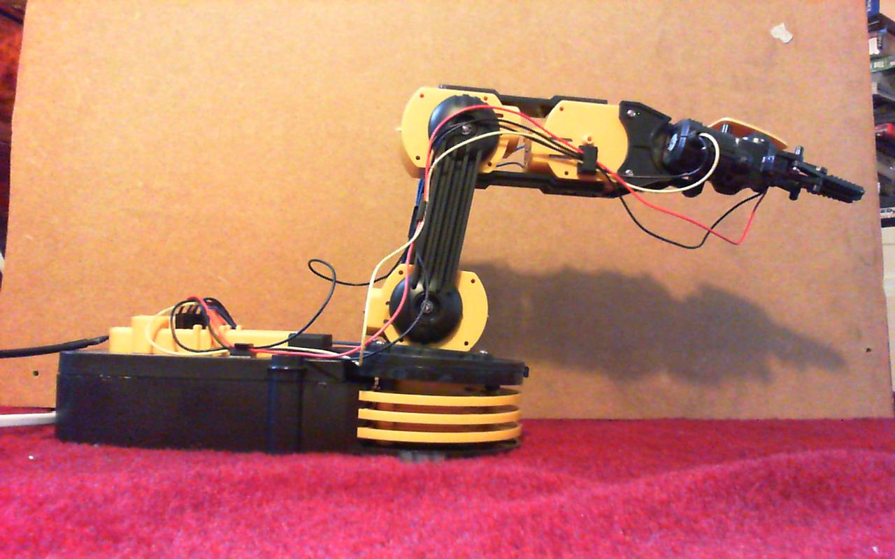
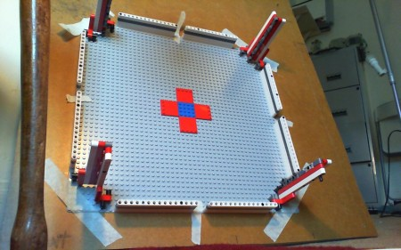
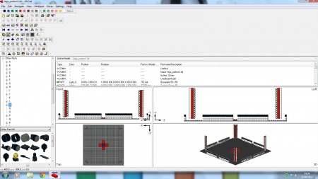
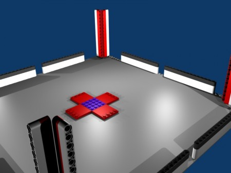
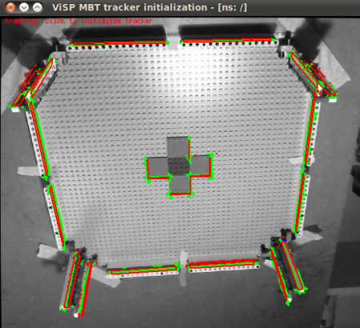
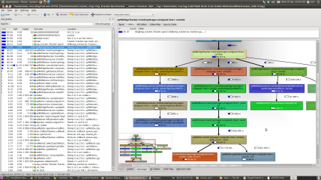
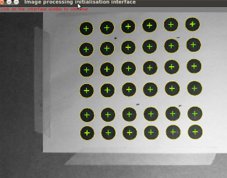

[](http://edinburghhacklab.com/2012/04/optical-localization-for-robot-arms-initial-experiments/2012-04-23-191534/)

 _If this can be made accurate, anything can_

Something I have realised is that there are no good open source robot arms in existence. Sure there are have been a few attempts ([Oomlout](http://oomlout.com/blog/2009/03/fancy_yourself_a_robotic_arm_d.html),  [TROBOT](http://www.kickstarter.com/projects/tbaumg/trobot-40-a-miniature-articulated-robot) (kickstarter) but these are toy scale robot arms. What researchers, engineers and entrepreneurs need are arms of similar specifications to those used in factories. Unfortunately those kind of arms start at £10k and go up to £120k and beyond.

Now a common fallacy in build-it-yourself projects is cost savings. There are very real reasons why industrial arms cost so much. They are precision engineered, made out of cast iron and use very powerful actuators. The high cost is attributable to the quality of the engineering used to achieve a strength and accuracy specification. However I think I have a shortcut to precision.

<!--more-->

High accuracy in industry is achieved by using precision anti-backlash (read expensive) mechanisms. Anti-backlash means the arm does not move by any means other than actuator control. The end effector of the arm reaches a predictable position because both the joints understand where they are, and the entire structure of the arm is very rigid and predictable. The rigidity of arm is achieved by using a very stiff material such as cast iron (in preference to steel which transmits unwanted vibrations).

High strength is achieved by using expensive actuators, which also need to be able to be controlled precisely for the accuracy requirements. The actuators have to be really strong because the arm is commonly built out of metal.

So to summarize robot arms are expensive, because just about every part of the system is built out of expensive components. I believe that there is a better way which would be adequate for a number of applications. Instead of using very high quality components to ensure the end effector is at a known location, we use a cheaply built arm and use optical sensors and vision processing to track the end effector in real time.

There are a few drivers for this approach which did not exist 20 years ago. Optical sensors are ludicrously cheap thanks to smart phone cameras, visual processing is getting cheaper as GPU costs are dropping and custom mountings for mechanically adapting commercial-off-the-shelf components can be realised using 3D printing technology.

So this is the motivation for my next major side project. Build a 2kg capacity, 1m reach, 0.1mm accurate 6DOF robot arm for approx £2000 of raw materials (I am looking for sponsorship BTW). Previous experience has shown that getting the software working is the hardest part in robot development, and sometimes can be made easier through mechanical hardware choices. Thus before I rush off, blow loads of cash and build a robot arm, the first step is making sure the software side of things will work. Which (finally) brings me to the point of this blog article, my first experiments in optical tracking.

The trigger for starting work was prompted by a new post doc starting at my university (Heriot Watt). He came from the Lagadic group in France, one of the leading institutes in research into visual servoing (controlling arms from cameras). They have a mature software stack called [Vision Visp](http://www.irisa.fr/lagadic/visp/visual-servoing.html) for doing exactly what I want to do (you can sudo apt-get install libvisp-dev !). He also revealed they have full time software engineers maintaining the code so I realised that this package was probably quite good in comparison to most research code. If the main software component can be sourced fairly trivially then what am I waiting for?! They were also [currently integrating](http://www.ros.org/wiki/visp) the software into my favourite robot development middleware, [ROS](http://www.ros.org/wiki/) (robot operating system), so theoretically it should be easy for me to integrate with other stuff (e.g. the actuator control system).

<iframe src="http://www.youtube.com/embed/pKDiX2S4m5o" frameborder="0" width="420" height="315"></iframe>

CAMERA SETUP

So my first implementation sprint was to see if I could get 3D optical tracking up and running using the vision visp software on a cheap USB camera.

I used a Microsoft LiveCam 3000. It was £18 from Amazon. I choose this because it was HD (1280x720) , 30FPS and I personally think Microsoft hardware in generally good quality and reasonable price. I was pleased to say it worked fine out-of-the-box with Ubuntu 10.04 (note 10.04 is the preferred version of Ubuntu for using robot operating system at the moment). I tested Ubuntu comparability by running the camera with “cheese”.

I then read the article at [IHeartRobotics](http://www.iheartrobotics.com/2010/05/testing-ros-usb-camera-drivers.html) and set the camera up on ROS using the usb\_cam package. By using rostopic hz /camera/image\_raw I could measure the framerate the camera was publishing at internal to ROS. I found that at 640x480 resolution the camera worked at 30FPS trivially. At 1280x720 the camera only published at 30FPS if the view was well illuminated. If the white balance of the camera kicked in, the next frame rate would be 15FPS, and in total darkness the camera would publish at a measly 1FPS. However, its not a big deal to put some lamps up if you know you have to do it.

SCENE SETUP

One of the tracking methodologies implementing in Visp works by matching high contrast edges of a known 3D model to the camera view. A human initializes the system by providing the initial pose of the model (by clicking on set points of the model in the image). So for us to achieve a high accuracy, we require a real 3D object, with sharp edges, and an accurate 3D model of it. Visp requires the 3D object to be specified in VRML 2.0

For the physical object, I thought Lego would be a good material. Lego is manufactured to an astonishing high tolerance. Each brick is a piece of precision engineering, which is manufactured in such quantities as to make them relatively cheap. The exact dimensions of Lego are well [published](http://www.robertcailliau.eu/Lego/Dimensions/zMeasurements-en.xhtml). So without much effort, you can use Lego to build an object of known dimensions. However, we also need that object in VRML.

[](http://edinburghhacklab.com/2012/04/optical-localization-for-robot-arms-initial-experiments/2012-04-23-191836/)

_I thought a good shape for tracking would be the inside of a box, with three orthogonal lines in each corner spread out over the field of view._

I thought my budget CAD suite did VRML but it didn't (bad Alibre!). However, Lego enthusiasts have actually built up their own open source stack of Lego engineering tools over the years in the form of Ldraw and MLCad (windows only 'fraid). This lets you build a Lego model in simulation, and they have EVERY POSSIBLE LEGO BRICK IN EXISTENCE MODELLED! I was actually blown away by how cool that software was. So by using [MLCad](http://mlcad.lm-software.com/) and the [Lego parts library](http://www.ldraw.org/), I was able to save my 3D object in LDR format.

[](http://edinburghhacklab.com/2012/04/optical-localization-for-robot-arms-initial-experiments/lego/)

_MLCad is cool! Don't let anyone imply otherwise_

 

LDR is not VRML though. [Blender](blender.org) however did have an python script for importing LDR files\*. Inside blender I could: get rid of all the pointless holes in my Technic bricks, remove faces that would not be useful for tracking and make a lovely ray-traced image of my Lego creation! Oh and I could also export to VRML.

\*once you have corrected all the windows file path conventions for running in Linux. Use the [LDRAW](http://wiki.blender.org/index.php/Extensions:2.4/Py/Scripts/Import/LDRAW) importer and not the LDRAW2 importer (it's about 10,000x slower and doesn't work).

[](http://edinburghhacklab.com/2012/04/optical-localization-for-robot-arms-initial-experiments/snapshot/)

 

 _Mmmm, gorgeous Lego in Blender_

TRACKING

As it turned out Visp only supports a very small subset of VRML. No transforms and the model should be specified in one block of coordinates. Using blender I was able to merge all the objects into one mesh, rescale the mesh and set all the faces to use one material. I then had to use the provided example VRML files in Visp to trim down the blender generated VRML into exactly the same form.

I actually used Visp to calibrate my camera too, but actually that was unnecessary. The usb\_cam package allows you to set the calibration settings, and the image\_proc package rectifies the image. My calibration parameters were very similar to the defaults in ROS so it probably wasn't necessary and slowed down my implementation bender unnecessarily. Here were my calibration settings for the LiveCam in the usb\_cam launch file. This shows the camera had very little distortion (+1 LiveCam 3000).

```
<rosparam param="D">[0.03983109092, 0.0, 0.0, 0.0, 0.0]</rosparam>
```

```
<rosparam param="K">[666.015717, 0.000000, 319.2997418, 0.000000, 662.0900984, 246.9209726, 0.000000, 0.000000, 1.000000]</rosparam>
```

```
<rosparam param="R">[1.0, 0.0, 0.0, 0.0, 1.0, 0.0, 0.0, 0.0, 1.0]</rosparam>
```

```
<rosparam param="P">[666.015717, 0.000000, 319.2997418, 0.000000, 0.000000, 662.0900984, 246.9209726, 0.000000, 0.000000, 0.000000, 1.000000, 0.000000]</rosparam>
```

I used the [visp\_tracker](http://www.ros.org/wiki/visp_tracker) package to recognise the 3D model. This uses moving edge detection so that once the model is initialized, it can utilize robot motion commands to predict where the new edges should be (and search for edges in that area). Using this supplied client GUI to initialize the tracker was straight forward. After initialization other tracker utilities can be used to view what is going on graphically and rostopic echo /object\_position can be used to dsiplay the calculated 3D potition and orientation of the object in real time. COOL!

So here we are, the tracker fitting the VRML model of the Lego to the video in real time:

[](http://edinburghhacklab.com/2012/04/optical-localization-for-robot-arms-initial-experiments/tracking2/)

_Its a fit! The central plates aren't being tracked properly, the suspected cause is incorrect face normals in the VRML._

ANALYSIS

So the tracker immediately after initialization was able to publish object updates at a rate of 25fps, which is a touch under the camera's publishing rate of 30fps (determined using rostopic hz /object\_position). Clearly the tracker was not able to process that volume of data, and I was only running the camera in 640x480 mode. Worse though, the fps went down over time, to 5fps. I tried fiddling with image queue setting etc. but could not prevent this runaway degradation in performance. Artificially limiting the camera to 15fps solved the problems, at 15fps of camera data the tracker could concurrently keep a steady 15fps of tracking.

While that is one potential one work around, it is undesirable. Visp documents suggest 25fps is the lowest frame rate for reliable tracking. If the tracker loses the object lock, there is no way back because the system requires human intervention to initialize (initialization is a hard vision problem).

Given the tracker was nearly fast enough on my computer. I decided to profile the code to see if I could push the code over the line. If I was working with a raw c++ program I would normally execute the program through the awesome tool [Valgrind](http://valgrind.org/). ROS however manages the launching of interacting programs through a launch file so I was not sure how instanciate the program with a command line prefix. Those brilliant ROS devs though of this though! The attribute “launch-prefix” allows me to instruct the system to prefix an arbitrary string so I was able to instrument the tracker program in the normal way. I used [kcachegrind](http://kcachegrind.sourceforge.net/html/Home.html) to visualise the profiled data

[](http://edinburghhacklab.com/2012/04/optical-localization-for-robot-arms-initial-experiments/kcachegrind/)

 

Nearly all CPU cost of running the tracker was concentrated in the tracking functionality, and in particular the convolution function. When I inspected the source it had evidence of being optimized at least twice! So the Visp guys know where the bottlenecks are clearly. I was a little surprised to see all the execution was being done in one thread though. I was told the package did parallel processing and CUDA optimizations but I was simple mis-sold. I was only using one core of my 8 core i7 over-clocked beast of a rig. If I could parallelize the convolution function, which looked likely (it was in a for loop), I could probably make the computational saving I needed.

Now I really enjoy optimizing code, but I have to be pragmatic. It would take a few weekends to extract a benchmark test case and perform the operation. My overall goal was to obtain a 0.1mm optical tracking system. There were other problems in my system completely unrelated to the tracker.

For the Lego model to be useful, it had to be upside down, hanging overhead the robot arm, with the camera facing skywards and attached to the hand. This put unusual stresses on the Lego model. On the modern Technic Lego bricks I have, under tension (in contrast to compression) they had a tendency to separate a fraction if joined by pins. Ultimately this meant my VRML model could not be accurate to 0.1mm so regardless of the tracker or optics, the 0.1mm accuracy target could not be achieved with this setup. Thus I am going to completely abandon this particular methodology of tracking a known 3D object using edge detection.

Visp has a different set of trackers for recognising textures on planar surfaces. There is some kind of ambiguity in the mathematics of recognising 3D position and orientation when recognition points are co-linear (as is the case with a planar object), but this can be resolved post processing. One of these 2D trackers is dot tracking, which uses a flood fill from an initial guess to detect circles (ellipses under affine transforms). This can be done a hell of a lot fast than edge detection so this will be the next line of enquiry.

[](http://edinburghhacklab.com/2012/04/optical-localization-for-robot-arms-initial-experiments/screenshot-3/)

 

_Thanks goes to Tom Joyce for helping with the fun bits (making lego decisions), Olivier Kermorgant for introducing me to Visp and giving strategic advice on visual servoing, and Thomas Moulard at Lagadic who responds well to my confused emails on the Visp mailing list._
