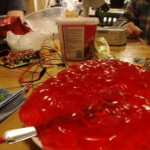

This Friday, 18th May, is our monthly music night, starting from around 8pm in the lab. Come along to talk about music, hacking, and make some noise! The month before last I wasn't there, and I missed out on Andrew and Tom's resistive fabric synth, and James and Matt of Madlab making instruments out of jelly. Don't make the same mistake I did: make sure you come to the lab on Friday!

This month Gareth is going to talk about using cSound to create sounds on your computer, and I hope we'll have some live performances from anyone who fancies it. There'll also be the usual blether and working on hacks throughout the night.

Bring your own hacks, ideas, news, and performances.

Hope to see you there :)

Alex
