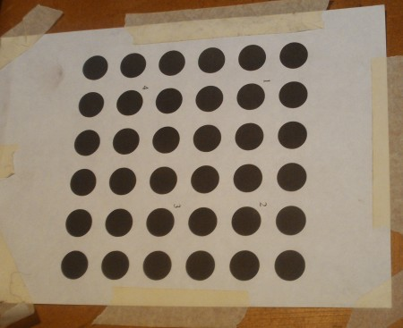
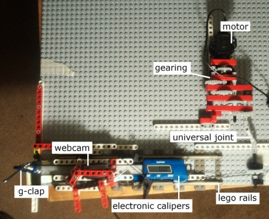
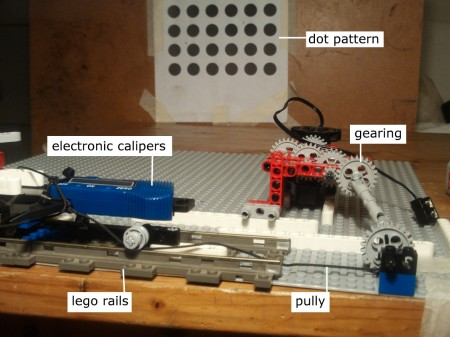
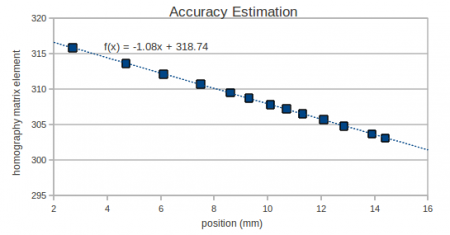
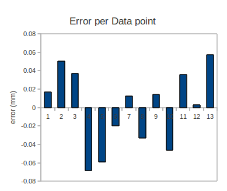
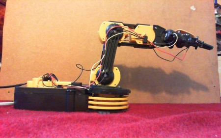

<iframe class="aligncenter" width="420" height="315" src="http://www.youtube.com/embed/Y1KQNuUBxAk" frameborder="0" allowfullscreen></iframe>

Quick recap, “the mission”: we want to build an affordable open source industry quality robot arm. We think we can make it out of low quality components but stick an accurate sensor on the end effector (the 'hand') and sidestep the huge costs of precision mechanical components. Web cams are cheap, and people already own computers capable of the required visual processing, so we think that optical localization is a better strategy for many applications that researchers, entrepreneurs and engineers might like to do - if we can get the optical localization accurate enough.

[Last time](http://edinburghhacklab.com/2012/04/optical-localization-for-robot-arms-initial-experiments/) we calibrated our £18 Microsoft LiveCam 3000, and experimented using [Vision Visp's](http://www.irisa.fr/lagadic/visp/visp.html) moving edge tracker. We found that the moving edge required a highly accurate object and we could not build one to the 0.1mm accuracy target we set ourselves. Furthermore, the actual moving edge tracker was not particularly CPU friendly, so we decided to pursue a different strategy this time.

<!--more-->

## Estimating Camera-to-World

<iframe class="aligncenter" width="420" height="315" src="http://www.youtube.com/embed/cAJX1SIKiqE" frameborder="0" allowfullscreen></iframe>

Vision Visp also comes with another tracker called the Dot2 tracker. This looks for ellipse blobs in the camera feed. The strategy for using this kind of tracking is to print a known pattern of circles on a piece of paper, fix the paper to the flattest object you can find, detect the dots and work out the transformation between the camera's pixel space, and the 2D coordinate system of the paper. In this experiment we want to determine the accuracy of this dot tracking approach.

With the moving edge tracker we were able to find a transform between image space and the real world (three translation and three rotation degrees of freedom). With the dot tracker, because the dots are located on a plane, this is not possible. We can only determine the “homography matrix”, which is a linear transform between two “homogeneous” coordinate spaces (2D coordinate systems in this case). Simply put, we can't tell the difference between the camera having a wide field of view VS. the piece of paper being far away from the camera. However, this not an issue in this experiment.

If you want to brush up on the details of homogeneous coordinate and homography matrices you can find everything you need to know at [here](http://en.wikipedia.org/wiki/Homogeneous_coordinates) and [here](http://en.wikipedia.org/wiki/Homography). Essentially, we change screen coordinates from (i,j) to (i,j,1) and model coordinates from (x,y) to (x,y,1) to make them homogeneous. Then the homography matrix estimation is just computing a 3x3 matrix that converts between them. Once you have that matrix you can convert between the two coordinate system easy peasy using matrix multiplication (remembering to divide by a constant to get the result back to (j,k,1) format).

Actually calculating the homography matrix is a little fiddly, but luckily it's all in the [OpenCV](http://opencv.willowgarage.com/) library (thanks!). You only need a set of 4 screen coordinates and 4 model coordinates to uniquely determine the homography matrix. However, if you have more than 4 sets you can “average” the results to get a homography matrix that fits them all as best it can. This is also in OpenCV but, in fact, the library goes further. OpenCV also provides a robust method of estimating the homography matrix:

`void cvFindHomography(srcPoints,dstPoints,H_passback, method=0, mask_passback)`

If the method parameter is set to CV\_LMEDS, any screen-model coordinate pairs that do not fit the (estimated) homography transformation very well are ignored and have no effect on the homography estimation (and the rejected outliers are reported in the maskPassback). This is exceedingly useful if, for example, you are getting screen coordinates from a tracker that has gone haywire (maybe the object it's tracking was occluded for example). Bad points will not affect the estimation results, and you can work out which points are misbehaving.

So for our experiments we wrote a piece of software revolving around Vision Visp's dot2 trackers and OpenCV's robust homography matrix estimation method. We used a 6x6 grid pattern of dots fixed to a piece of wood, and attempted to track the dots in real time from the camera feed, and estimate the homography matrix using the detected dots in the image and the corresponding dots in the (known) grid pattern.

Our software was initialized with the position of the 36 dots in the image (using Vision Visp's inbuilt calibration GUI). From then on, our algorithm proceeded as follows:

1. Estimate the homography matrix robustly, making note of any outliers.

3. Use this homography matrix to predict the expected position of the outliers on the screen given their known position on the paper

5. Reinitialize the trackers on the screen using their expected position.

7. Repeat with next frame.

This meant that if dot tracking was derailed by a shadow, a change of light or a fast movement etc, the tracking would be regenerated as long as there were enough good trackers still active (out of the 6x6 = 36 options). This tracker regeneration worked remarkably well and loss of tracking was no longer a problem.

<iframe class="aligncenter" width="420" height="315" src="http://www.youtube.com/embed/Mx7nPICx2lY" frameborder="0" allowfullscreen></iframe>

## Estimating Accuracy

For our experiments we decided to test the ability of the system to detect lateral movements of the camera. These are the degrees of freedom the homography matrix will estimate best due to the viewing geometry. For a robot arm application, we could place several cameras at 90 angles to one in order to get the best in all dimensions.

Our mechanical challenge for the experiment was to build a test platform that could precisely move the camera a measurable distance at an accuracy of 0.1mm. The major cause of inaccuracy in mechanisms is “play” or “backlash”. That's that feeling of give when you rotate a crank, and it feels momentarily weightless when you reverse direction. This is cause by empty spaces between all the physical components having to be traversed before all the components are rigidly in contact with one another again. You can remove it by using tension in a constant direction which keeps everything engaged (a.k.a. preloading). With thoughtful design and a dollop of trial-and-error, even Lego can be turned into a precision system!

We experimented with a few different methods of preloading. A common approach is using elastic bands, but we didn't have any in the house at the time so we had to use the inferior method of using pulleys and weights to redirect gravity into a force we could position in any direction. In the end that didn't work out either (sorry no pics), it's mentioned just because it was an option considered.

Another source of error is [stiction](http://en.wikipedia.org/wiki/Stiction). Sticky components need a high force to start them moving, but then a lower force to keep them moving. As soon as they stop, a high force it required to restart movement. This is a common effect and can result in a chain of components acting indeterminately. This problem is hard to resolve, and can actually be exacerbated by preloading :/ The solution is to use low friction components. In Lego engineering, the best low friction components are their train sets. The bogeys glide effortlessly over the tracks and make awesome linear bearings! (once you deal with their lateral play).

So we mounted our camera on a set of Lego bogeys on a train track. The distance the camera carriage moved on the track was the degree of freedom to be correlated with the homography matrix. To measure the distance in real coordinates, we firmly attached a set of digital calipers to the setup using a G-clamp (a.k.a. The lego to real world adapter).

The final piece of the puzzle was how to move the carriage at sub-millimetre position. We tried using our hand, but it was impossible to do without significantly shaking the whole apparatus. This is another source of error, external vibrations. Vibrations can move components relative to one another and leave the system in a novel state. To remove human influence we heavily geared down an electric motor and pulled the camera carriage via a pulley.

With the setup complete we could buzz the motor and move the carriage a distance of between 0.5mm and 1.5mm depending on how quick we could turn the electric motor on and off. If we built the setup again we would have probably added another level of gearing down, as 5 was barely enough (!). The pulley arrangement meant the carriage could only be moved in one direction, but that sidesteps the backlash problem and was enough to gather the accuracy data.

## Results

With the camera parallel and aligned with the pattern, when the camera moves laterally, only one element in the homography matrix changes (en element in the last column or row). Moving the camera on the track by hand made it obvious which element was correlated with the translational movement we were interested in. OpenCV normalised the matrix during estimation, so although the homography matrix estimation is known upto a scale factor, OpenCV sensibly chooses a scale factor that avoids numerical problems and is consistent across applications. We gather results by moving the camera carriage and correlating the homography element against the readout from the digital callipers. If the system is accurate, those points should all lie on line....

Wow, looks like a straight line. Could it be more linear? (technically yes, but only slightly). We used open office to fit a trend line. We can then predict a position of the carriage in mm based on the homography matrix element using the trend line, and compare this value to the observed values for the data points we collected. This gives us an error reading for each data points. This is the critical quantity for our system, and our hope was to get it within +-0.1mm across all points. Below is is the error for each data point:-

As you can see, all the points are within the 0.1mm bound! As our calipers themselves are only accurate to 0.1mm we managed to get the setup to the limit of our measurement accuracy. The system is more accurate than 0.1mm but we just can't determine how much! Furthermore the errors are healthily distributed around the mean (not all positive one side and all negative on the other). This suggests our system really is linear ([full data](https://docs.google.com/spreadsheet/ccc?key=0AvOc7B1WOKB2dG9aTDdRd2JhQ3JXTldvWjVrZU9SSHc)).

List time we did experiments we had problems with the computer not being able to tracker at the rate the images were published. The simplicity of the underlying tracker code meant this new tracking system was much faster. We were able to perform the robust estimations at 30fps without the computer breaking a sweat. Furthermore this is without parallelization of the the tracking code, which suggests we could do the tracking on a much cheaper computational platform than my medium settings Crysis rig.

## Conclusion

Woo! we can do it!

The accuracy we have reported is below the threshold that a single pixel could report. This sub-pixel acuity begins at the vision visp dot tracker code. The dot tracker estimates the centre of mass of the ellipse by estimating the centre of the ellipse given the perimeter, this means it can report a floating point estimate of the centre and NOT an integer pixel coordinate. These estimates of position are further improved by integrating the information held in multiple dots using the OpenCV homogeneous matrix estimation functionality. The more information that is used to derive the position, the greater the accuracy we can achieve.

The accuracy of our system could be improved by using a higher resolution images (we used 640,480 but the camera goes higher), more dots or multiple cameras. However, the final accuracy will also be reduced if used to determine both the 3D position and orientation of the pattern. We have fixed our rig to only have freedom in one dimension, so if we used the same setup to determine the rotation and translation components of the pattern, our input information would have to be shared between all unknown dimensions. Thus, we would lose some accuracy on individual dimensions (although it might still be 0.1mm accurate). Given how accurate the system appears to be currently, we don't expect this to be a problem. In fact, given we have so many ways we can improve accuracy further, a target of 0.01mm accuracy at 30fps may be achievable.

Next time we will switch from sensor processing to actuator control. Our mission is to build a robot out of cheap materials. Our physical components will not be rigid, and our material properties will change over time. So the “write down the kinematic equations of the system” linear approach will not work accurately over time. Instead, we will need our system to learn its own non-linear model of itself autonomously which should adapt over time, luckily I happened to have had the good fortune of being taught motor control by Sethu Vijaykumar who co-created the leading algorithm in non-linear adaptive control: LWPR (http://wcms.inf.ed.ac.uk/ipab/slmc/research/software-lwpr). Unfortunately they have not integrated their efforts with ROS, so I will have to do that for them (Grrr, more coding).

Tom Larkworthy & Tom Joyce

UPDATE: We are integrating some of this code into a linuxCNC-ROS bridge git@github.com:tomlarkworthy/linuxCNC\_ROS.git to stay updated use the [linuxCNC forum](http://www.linuxcnc.org/index.php/english/component/kunena/?func=view&catid=10&id=20874)
