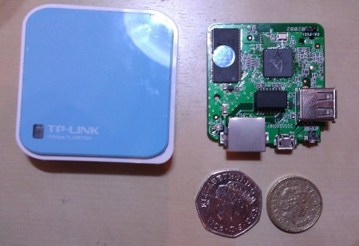
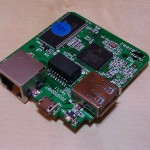

My Raspberry Pi delivery date is now only **two** ice ages away! Until the mighty Pi ships, where can you get a cheap embedded Linux fix? Please welcome the catchily named **TP-Link TL-WR703N**!

So what is it? For about £20 you can get a teeny embedded Linux device (in a nice little enclosure) with built in 10/100 ethernet, 802.11bgn wifi and USB. Not bad for the same price as an Arduino! The device is intended to be used as a "travel router", you're supposed to shove a 3G dongle in the USB socket and then use it as a personal hotspot. It'd probably be handy to have one for that purpose, but that wouldn't be very hacky would it?

I bought one of these after Stephen Giles recommended it on the Hacklab [discuss mailing list](/about/#mailinglists "About"), turns out a few other members and Hacklab regulars have too. This device looks to be pretty popular with hackers, so you can expect to see it turn up in projects online (and probably in the lab too...).

Why so popular with hackers? Well, despite shipping with a Chinese web interface, it's a doddle to flash it with [OpenWRT](https://openwrt.org/), a lightweight Linux distro designed for routers and other low-spec embedded devices. Following [these instructions](http://wiki.openwrt.org/toh/tp-link/tl-wr703n) on the OpenWRT site I was up and running in a few minutes. A few minutes later I was installing some packages and half an hour after that I had it configured as a client on my wifi network.

So what can be done with it? With OpenWRT installed, you can use it as nature intended and do some routing, making a nice small router/WAP. Or you can install packages to enable it to be a file server, using a USB flash disk or hard disk to make a tiny NAS box. Or you could attach a USB printer and make it a print server. Or you could plug in a cheap webcam and stream video. Or, and this is where it gets interesting, you could hook up something to the device's onboard serial port ([some soldering required](http://wiki.villagetelco.org/index.php?title=Building_a_Serial_Port_for_TL-WR703N)...) and internetify an LCD, or a temperature sensor, or an anything really. After the flashing LED, the UART is the embedded hacker's best friend!

Sold yet? You can buy them from [eBay](http://www.ebay.co.uk/sch/i.html?_from=R40&_trksid=p5197.m570.l1311&_nkw=tl-wr703n) for <£20 shipped to the UK from China. They come with a US power supply but can be powered via micro USB.

I'm not sure what I'm going to do with mine yet, any ideas?
