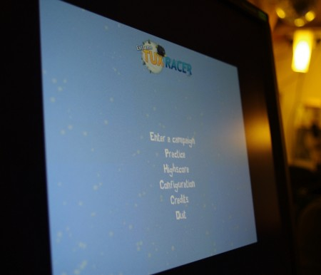
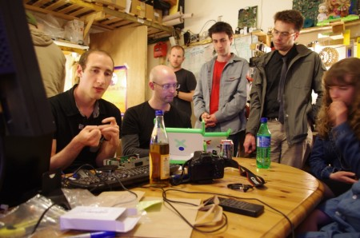

So after much waiting the first Raspberry Pis to arrive put in an appearance at last Tuesdays open night. After no small task of finding a USB keyboard and mouse and doing an HDMI monitor bodge we were ready to go. So what is the first thing to do with the Raspberry Pi, lets play some sound. Oh, the media player app can't recognise the sound device, someone else must of had the problem, yets look it up. Out came several iPads to help look up the solution and best part an hour later we had sound, yah!

On the back of the sound success we thought it might be a good idea to try playing a game, because after all the programmers of the future can't hack python all day can they? How about a bit of [ExtermeTuxRacer](http://extremetuxracer.com/)? A few aptitude commands later it was installed and ready to go. After a bit of a delay the sound track started playing so we knew we had well and truly nailed that particular issue. Graphics performance was sluggish to say the least, a few frames a _minute_ was the best we managed to get and it never made it into the level properly before we gave up and pulled the power out. We suspect the graphics drivers wern't making use of hardware acceleration built into the Pi and was doing all the rendering  painfully in software.

So in summary if you do sensible things with the Raspberry Pi is just works. The driver setup needs a bit of work but this will likely be fixed in future releases of the software.

Whilst the Raspberry PI was stuggling on TuxRacer Garry got his rather large collection (5?!) of [One Laptop Per Child](http://laptop.org/) machines out of his bag for everybody to play with.

The [Eyeborg](http://www.eyeborgblog.com/) guys where also using the lab working on their most recent iteration of the Eye. This involved curing something interesting in a microwave, doing some precise dremeling in the bathroom and soldering some _tiny_ components together.

Another interesting and busy Tuesday night. If you have a project you would like some advice on maybe you are just interesting to watch and listen then you are very welcome to come along. See our [events page](http://edinburghhacklab.com/events/) for more information.
