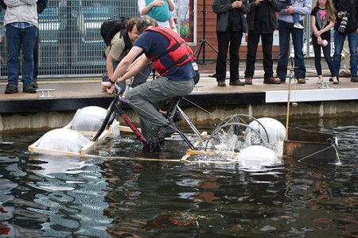
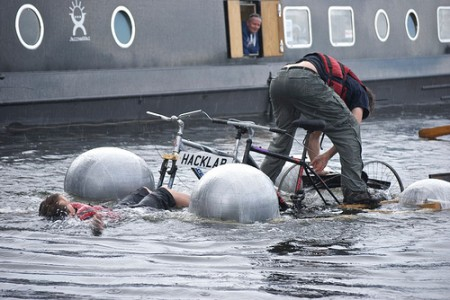
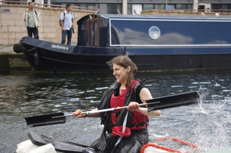
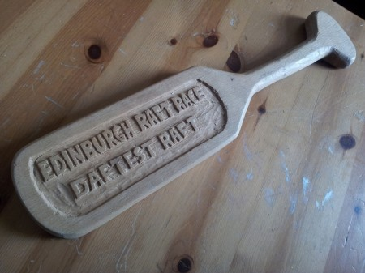

After last years raft race, that we [wrote about](http://edinburghhacklab.com/2011/07/raft-race-report/ "Raft Race Report") at the time there were grand plans to as to how the raft could be better. We would start building further in advance, there wouldn't be any pallets used and no fitness balls either.....

.... fast forward to two weeks ago. Late Tuesday night as hardware open night was winding down raft design sketches where drawn a piece of paper. It was ambitious, needed some level of precision and if everything worked it might move along the canal.

Access to a garage was acquired as a base of raft building, it's close proximity to the Forth meant sea trails were an option. Materials were obtained, late nights were had and the raft was ready to take to the canal. All that had to be done was to transport is there. The width meant most common vans couldn't fit the raft and a bigger one couldn't be hired at late notice so a plan was made that involved strapping the raft on top of a trailer for a journey across town, leaving a trail of slightly bemused people as it passed.

Some final adjustments were made to the fitness balls (yes, they had made a reappearance to provide buoyancy) just in time for the start of the heat. We were up against a ladybird-patterned coracle. Unfortunately a critical set of cable ties broke and the chain kept coming off and the rudder also suffered a slight malfunction. Buoyancy was not an issue and the stability issues of last year were a distant memory. Bart and Martin managed to keep it moving by a combination of  manual paddle turning and towing with some backstroke. They eventually made it to the finish line followed by a well deserved applause.       

The time of the final arrived, Gandolf took over the coracle as its owner wasn't there in time. Jane also joined in with a raft made out a metal frame with polystyrene fishbox and blocks for bouncy. Gandolf manged to stay dry and avoid tipping the coracle and finished 3rd. Jane was very pleased to finish and on further investigation the fish box sealing had failed leading to the box taking on quite a lot of water.

As the raft was being disassembled we heard Hacklab being mentioned over the PA,  the bicycle powered hacklab raft had won Daftest Raft award. Success at last!

[Lots more great photos taken by Gary Martin](http://www.flickr.com/photos/50394334@N00/sets/72157630385894696)
