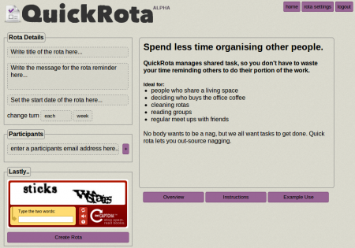

[www.quickrota.com](http://www.quickrota.com) is a site that allows a group of people to co-manage a regular rota. Participants of an active rota are emailed one-at-a-time to indicate when “its their turn”. Tom Joyce and I developed this over the last 3 months in response to a problem we see in my jobs, flats and in Edinburgh Hacklab.

There are some tasks no-one likes doing. In a shared flat it's the bins. In academia it's update the website, or organise the weekly seminar. In the Hacklab it's post a wordpress article (although I like doing it). In these contexts no-one is really professionally compelled to do these things, so everyone understands its best to just take turns doing them. In practice though, a rota needs a dragon to enforce it, because once the rota gets derailed, that's the end of that.

The dragon of a rota hates being the dragon though. They still have to do the unpleasant task AND they have to nag everyone else, \*every week\*. So that was the inspiration for quickrota, I am truly sick of nagging people to do things. Lets make the computer do the nagging!

Its like an email list, except that only one person is emailed on the list regularly. We made it super easy to setup a new rota, because organisations like hacklab should be able to create project groups and tear them down really fast. Furthermore, everyone in a rota is an "admin", anyone can add/remove other participants from the rota, it is designed for tasks with no single point of failure.

I have been playing with QuickRota in my personal life for a few months now. My favourite rota was one I set up with my girlfriend to demo how it worked. I created a rota called “its your turn to be nice” which fires once a week. I was not serious about it, it was just an example. But the following week after, I had totally forgotten about it, and I was in a bad mood. Anyway, that morning I received an email to be nice (from myself in the past) and it made me think twice and get over my grumpiness. Since then my girlfriend and I have taken “be nice day” really seriously and it has turned out to be brilliant fun every Sunday.

So I hope you enjoy [www.quickrota.com](http://www.QuickRota.com), its free. Experiment with rotas, I genuinely think this is an awesome way of living/working but maybe because I am part robot :p Send me your feedback!

Tom
