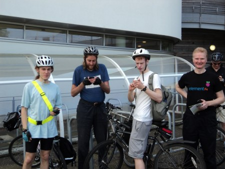
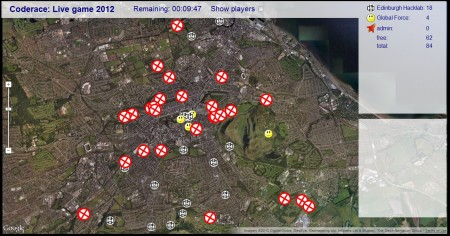
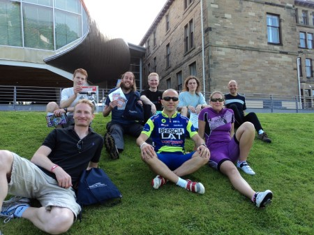

In true Hacklab style we found out about the event (Thanks Jane!) with less than a week to go. After a bit of hasty origination we had 4 Android phones, 4 people, 3 bikes and one car.

The rules were simple. Go to points marked on the map, use a clue to find the answer and enter into the App. Only the first player to enter the correct answer at each location would score. When a clue was solved 2 extra locations would appear somewhere on the map. About 15 minutes before the game started we were shown the game area, it was larger than expected.

Alistair, James and Peter, were riding bikes whilst David was driving a car. Strategies were discussed and then simplified to, "go to an unclaimed point near you that somebody else isn't near to". We were up against a team with some serious looking cyclists, wearing Lycra, sun glasses and everything. We were a bit worried that our lack of cycle fitness might find us wanting...

\[caption id="attachment\_1045" align="alignleft" width="450"\] Ready to Set off. Left to Right: Alistair, James, Peter and David. _Photo: [Coderace](http://www.coderace.co.uk/)_\[/caption\]

We left Edinburgh Napier Craiglockart campus at 2pm, with 2 hours to get as many answers as possible. Most clues were fairly straight forward but some involved a bit more work and strange looks from members of the public as an out of breath cyclist asked what was written on the plaque attached to the bench they were sitting on! There were a few technical hiccups with Alistair's phone hitting the data cap and then the battery running out. It gave him a bit for free time to do some juggling entertaining passers-by in the Meadows. The really nice weather meant reading phone screen was sometimes a little tricky in the sun, but it's much better than having a wet phone.

Slightly surprisingly Edinburgh Hacklab pulled out ahead and the final score was 18, 4. James got the most points solving 6 locations, whilst Peter got 5, including ne with 45 seconds to spare. It was a really enjoyable day and has given us some ideas for future location games.

Many thanks go the other competitors, the organising team especially Brian who was very receptive to our bug reports and enhancement suggestions. Thanks also to the sponsors for providing prizes. More information on the [Coderace website](http://www.coderace.co.uk/) Alistair has also [blogged about his experience](< http://mm0hai.net/blog/2012/08/04/Coderace.html>)

Looking forward, to next year's event with hopefully more teams to compete against.

\[caption id="attachment\_1048" align="alignleft" width="450"\] The final game play screen, the red crosses were unclaimed points\[/caption\]

\[caption id="attachment\_1050" align="alignleft" width="450"\] Relaxing with the other team. _Photo: [Coderace](http://www.coderace.co.uk/)_\[/caption\]
