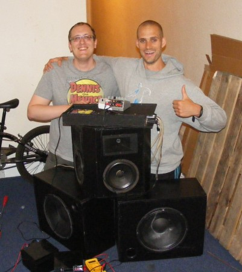

We had an interesting visitor to Tuesday's Open Night: Ben Hammond of LearnBurma. Ben is currently dancing from John O'Groats to Land's End! It's all to raise awareness of the situation in Burma and some money for charities working in and for Burma. You can read more about Ben's challenge on the [Dance Britain website](http://www.dancebritain.com/).

So where does Hacklab come in to this? Well, Ben's dancing along to a trike-mounted soundsystem (which some poor sucker in the crew has to ride), but hit a few a few sound issues around Dundee (particularly some dodgy connectors and "farty" bass). We made some repairs and twiddled about with the amp and active crossover and got it sounding pretty sweet. Ready to roll on south!

Here's Ben's trip so far...

<iframe src="http://player.vimeo.com/video/48448481?byline=0" frameborder="0" width="500" height="281"></iframe>

Ben and the crew will be passing through Edinburgh soon, keep an eye on [@dancebritain](https://twitter.com/dancebritain) for updates, and an ear out for a loud trike...
