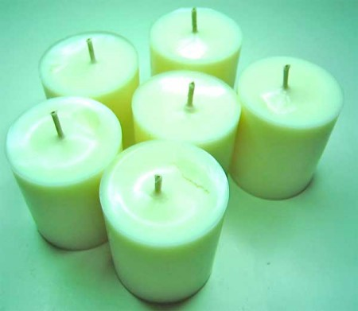

\[caption id="attachment\_1121" align="alignright" width="315"\] Photo by [Deadicated](http://www.flickr.com/photos/deadicated) - Creative Commons\[/caption\]

Edinburgh Hacklab are pleased to be hosting a Candle Making workshop. Covering the basics of candle making it aims to give participants enough knowledge to try some candle-making of their own.

Areas covered will include:

- Different types of candle and wax
- How to safely melt and pour wax.
- Basic candle making techniques.
- Re-using wax successfully.

Location: Edinburgh Hacklab \[[Getting There](http://edinburghhacklab.com/visit/)\]

Date: Sunday 7th October 2012

Time: 10am until about 2pm (quite a bit of this time will be spent waiting for wax to cool)

Cost: Free, required materials are provided.

Registration: Email [peter@greenhac.org.uk](mailto:peter@greenhac.org.uk) if you would like to attend, or have any questions.
