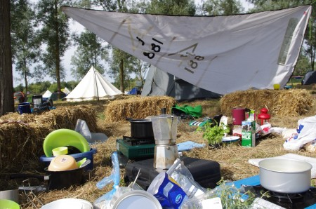
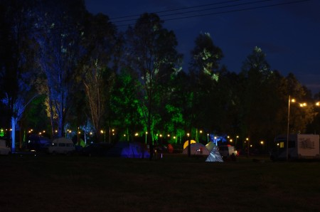

The first UK hacker camp in many years was taking place in Milton Keynes, hackers, makers and other interested people were going to be there from across the UK and beyond. It was an opportunity that couldn't be missed. After a early start the "hackbus" (a hired 9 seat mini-bus) was making good progress and we arrived by mid-afternoon in time to put up our tents and connect to the supper-fast Internet connection before the first talk started....

There were several other hack spaces, including [NottingHack](http://nottinghack.org.uk/) that had brought a gazebo village complete with laser cutter. Our "village" was slightly more modest a few straw bales with cooking equipment spread out nearby. A borrowed sail provided the only means of identification and protection from rain, that fortunately didn't occur in any significant quantity.

\[caption id="" align="alignnone" width="450"\] Edinburgh Hacklab Village\[/caption\]

<!--more--> Harry ran a very successful workshop [Arduino Workshop for the Curious](http://wiki.emfcamp.org/wiki/Arduino_Workshop_for_the_Curious) that gave an introduction into the Ardunio.

Peter gave a talk about a project he's been working on for the last few months involving sending an Android phone through the post to track the route it takes. The talk went well despite some display resolution issues and received positive feedback along with some offers to post the tracker from interesting places.

There was opportunity to meet up with friends we hadn't seen for a while and make some new friends along the way. There was quite a bit of media coverage including a [BBC Article](http://www.bbc.co.uk/news/technology-19441861), look out for a one second clip of our very own Tom L, 11 seconds from the start of the video.

As a fully volunteer run and organised event EMFCamp couldn't have taken place without the assistance of volunteers. A few of us volunteered for security shifts on the the main gate, an enjoyable way of meeting fellow campers and local dog walkers curious to know about the event taking place. Thanks everyone who brought cooking gear, cooked food and did the washing up, Alex for arranging transport and Jane & Bart for being additional drivers.

The next [EMFCamp](http://emfcamp.org.uk/) is provisionally scheduled for 2014. The Edinburgh Hacklab village will be bigger and better that is for sure.

See the EMFCamp wiki  for [lots of photos](http://wiki.emfcamp.org/wiki/Multimedia) and [talk videos](http://wiki.emfcamp.org/wiki/EMF2012_Video) are they become available and [Peter's photos](http://www.flickr.com/photos/greenhac/sets/72157631473231816/)

\[caption id="attachment\_1106" align="aligncenter" width="450"\] Night falls on EMFCamp\[/caption\]
