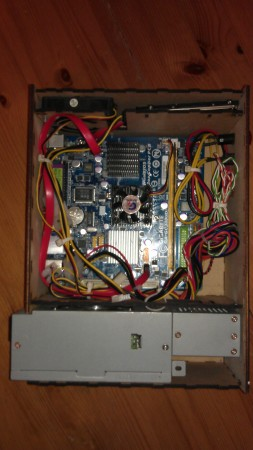
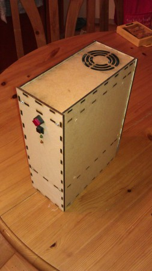

There are a range of mini-ITX form-factor motherboards these days, usually supplied with a low-power CPU as well as the normal on-board options such as LAN and audio; just add memory, PSU and some form of storage to get a complete, very small PC. Oh, and a case, which is usually where the fun begins.

I've built a mini-ITX board into a bread-bin in the past, which worked fairly well for several years, but I wanted to have a go a manufacturing a case rather than re-purpose something. So one trip to ebay to acquire the parts (dual-core Atoms don't feel much faster than single-core ones) and I was ready to start.

The case was intended to be cut out of acrylic, or whatever plastic stock the laser likes working with. however MDF is a lot cheaper, so the initial test-cuts were done in that. In the end the MDF looked nice enough to stick with - I might be tempted to rebuild it in plastic at some point in the future. The case was designed in SolidEdge CAD - I've never found a open-source CAD program I like, and SolidEdge is the free-but-proprietary program I'm most familiar with. I've been told several times about box-building programs which will layout all the little tabs for you, but it's more fun to do it yourself.

This shows the overall layout of the case - it's designed around the ancient 220W PSU I had kicking around, which is probably a unique size. The hard disc and system fan sit in the top compartment, and a couple of LEDs and switches on the front panel. The motherboard sits on some of the normal spacers you always get with a case or motherboard, screwed into pilot holes cut into the side panel. Unfortunately I got the maths wrong converting the imperial units in the mini-ITX standards (thanks guys) back to metric, so it's only held in with three screws - one more reason to . The front and rear panels are held in with M3 screws into nuts which were epoxied into place - you can just see them in the corners of the 2nd and 3rd horizontal pieces. You can also just make out the slots for the DVD-drive brackets, before peer pressure from various lab members convinced me I didn't need it.

The completed case - running Bohdi Linux and sitting the corner of the kitchen playing videos and MP3s and generally doing little that couldn't have been achieved with a Raspberry PI for a fraction of the cost and effort. And fun.
