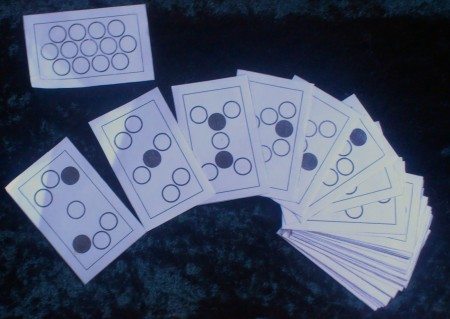

Do you have dreams of making a game, be it physical, computerised, or otherwise?  Are those long November evenings looking cold and empty?  Read on.

\[caption id="attachment\_1145" align="alignright" width="450"\] Jubilee- a card game inspired by group theory, by Amy Worthington\[/caption\]

November is known to many hobbyist authors as [National Novel-Writing Month](http://www.nanowrimo.org/ "nanowrimo main site"), a month where you can sit down every evening and write 1667 words.  At the end of 30 days, you've written 50,000 words, and you can claim to have written a novel.  This year I had made plans to do exactly that, but as I evolved my ideas into a plot, I realised that it would be more fun to make an adventure game.  And so I repurposed November as Make a Game Month.  Every day, for thirty days, I would develop a bit of the mechanics, the artwork, the music, or the plot structure of the game.  After thirty days, it might not be perfect but it would be a playable game and I could share it with friends.

When I told my friends about this, it turned out that a few of them were doing the exact same thing.  More still were inspired by the idea, and it's kind of in the process of snowballing into something amazing.

**Want to join in?  Here's how!**

## Rules:

1. Between 1st November and 30th November, make a game.  Any sort of game.
2. On 1st December, let someone else play your game.
3. A winner is you.

(National Novel-Writing Month has a lot more rules than we do.  This doesn't really make as much sense with games, so we suggest you think of your own rules to stick to, to reach the best game you reckon you can make in thirty days.  If you want to bounce ideas off other people, there are suggestions below for places to do that.)

## **Stuff that isn't rules**:

1. Click the reply button below, and tell us what you're going to make!
2. Sign up and chat on the [hacklab-discuss mailing list](http://edinburghhacklab.com/about/#mailinglists "How to join the Edinburgh Hacklab mailing list.").  Tell us about the game you're going to make, tell us how you're getting on, ask questions, send us pictures when you're finished, find beta testers, whatever you like.
3. Tweet using the hashtag [#makgammon](https://twitter.com/search/realtime?q=%23makgammon "Twitter search for #makgammon").
4. Come along to the Edinburgh Hacklab on the 1st of December at 5pm to show off your game, and play other people's.
5. It can be any sort of game, the fact that I am making a computer game myself is purely coincidental.  Make a card game, a roleplaying game, a music game, whatever might entertain you.
6. The only prize is the game that you made, though if more than five people are likely to show up on 1st December I might get some badges made.
7. You can give it to someone for Christmas.

Make a game, play it.  What's not to like about that?
