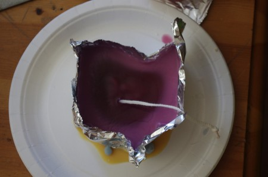
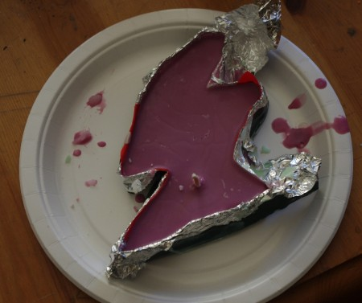
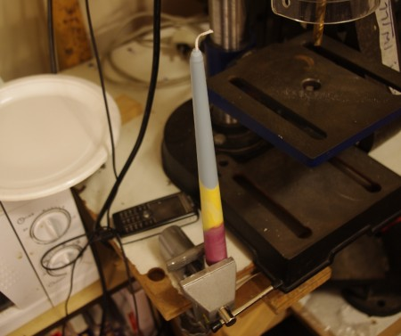
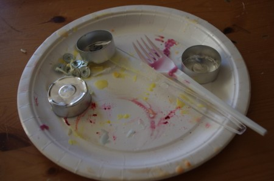

Exactly a month ago the first Candle making workshop took place at the lab on a unseasonal sunny Sunday morning. After a quick run through the types of wax and candles, and some safety tips it was time to get candlemaking.

Kayla decided to make a candle in the shape of her home state of Ohio. Tinfoil was acquired and used to make a mold.

\[caption id="attachment\_1156" align="aligncenter" width="450"\] Ohio\[/caption\]

Following the same theme Grace made a mold in the shape of the Scottish mainland using tin foil and electrical tape (we couldn't find any duct tape), there were a few significant leaks but they were plugged by the first poring of wax. A wick was added followed by a few more layers of wax.

\[caption id="attachment\_1155" align="aligncenter" width="450"\] Mainland Scotland with raspberry purple top layer\[/caption\]

Al went with a slightly more conventional design using a commercial mold with a bit of tilting of the layers.

\[caption id="attachment\_1157" align="aligncenter" width="450"\] Al's creation\[/caption\]

Ashley used a ginger beer bottle as a mold, to be broken a day or two later once the wax had set, hopefully reveling a beautiful bottle shaped candle.

Enjoyable day had by all, with some tips picked up for future candle-making. Look out for some more workshops at the lab....

\[caption id="attachment\_1154" align="aligncenter" width="450"\] All finished...\[/caption\]
