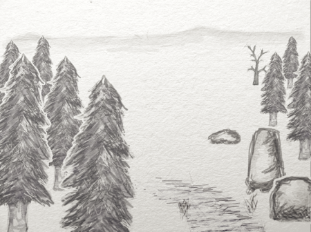
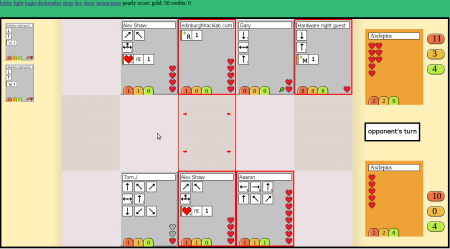
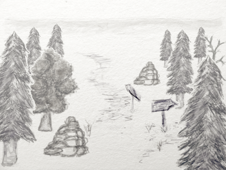
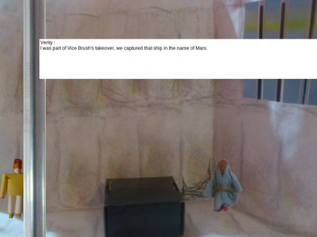

So 1st of December was the conclusion of [make a game month](”http://edinburghhacklab.com/2012/10/make-a-game-month-makgammon/”), an idea that was created by Edinburgh Hacklab. Was it a success? Yes, but maybe not how we initially expected it to be. Of the 5 initial developers who said they would build a game, only one turned up. However, we had some extra game developers turn up unexpectedly, and the range of concepts explored that evening was exceedingly broad.

#### RuneSketch

Runesketch was a game that was already under development when the idea of makgammon was suggested. Thus, the 2 person dev team had a significant advantage in pulling something together in a month. The concept of Runsketch is a collectable card game (like pokimon) that players fight over the internet. Winning matches makes “money”. Money buys more cards to improve card decks. Which makes fighting easier etc. etc.

Runesketch is designed to be played over the internet, checkout www.runesketch.com. However, like many many demos before it, it didn't work on the night! However, we did manage to play three games on the local development server using a laptop.

Feedback from the gamers on Runesketch was quite inspiring. The cards were humorously themed on actual members from the Hacklab. Recognising the mapping between known personalities and mechanics on the cards brought a lot of engagement as a result. The actual game was too complicated for people to learn in a casual setting. The idea of a simpler Hackerspace game caught the imagination of some of the visitors that night. That game is an ongoing concern. So lookout for a working demo some time early next year.

#### Hand Drawn Maze game

Gary Martin came to the lab with an OLPC's XO-4 Touch computer and some beautiful scenes drawn using it. The maze game would be played in much the same way as a text adventure, the player could turn 90 degrees, go forward a step etc. The players view would be generated by by billboarding hard drawn representations of each tile and transforming them into the correct position. As the game is played on a grid, the math of projection is much simpler and 2D drawings can be used instead of 3D data (eat your heart our Carmack).

For the actual mechanic Gary was drawing inspiration from Hunt the Wumpus. While not fully decide yet, perhaps the player would also have an AI on the map they would need to interact with. However the main innovation is the graphics engine, the beautiful scenes and how they were drawn. Everyone was amazed at the responsiveness of the XO-4 touch interface. It is not a capacitive technology like the iPad and has an instantaneous response. Its really good for drawing and you can use physical objects instead of fingers to do fine detail. This game would be an excellent starting point for people to learn about game's programming.

#### The Game of Storytelling

Pearly dropped in to show us some early conceptual work he has done towards a game about story telling. His observation is that 4 people in a room should be able to create a story about whatever. Story telling is more than a chronological list of facts that happened, or things that were said, but also about the how and why. Its also about how the audience reacts to the presentation. It is the meta aspects of story telling that makes the difference between a dull or engaging documentary. Pearly's aim is to distill the whole story creative process into a game dynamic that can be explored by a group of people.

One of the key parts of this mechanic is a dice with metaphorical story structures drawn upon it. One side of the dice represents the future, the past etc. In addition, further labelling decides how the group as a whole expresses the dice's intent. So for certain rolls a group of 4 would split into 2 groups and one group would passively listen to the other two doing an improvisation for example.

Unfortunately the game is not in a playable state yet. It sounds fantastically novel. I image all players need to be dedicated for the system to work, but has the potential for blowing minds if everyone really gets into it. It might be really useful for writers who already understand the mechanics of stories. Perhaps tutorial should be in video format so noobs could understand the flow better.

#### Excom

Alex Shaw (co-organiser of makgammon) was unfortunately ill :( However he did send us the link to his game Excom http://www.glastonbridge.co.uk/games/excom1/. That game made me laugh as soon as it was opened. The graphics and language are all stamped with Alex's personality.

The game so far is working towards being a graphical adventure a bit like monkey island. There is not much to do yet but you can move your character around and enjoy a dialogue between two NPCs in the initial room. The story setting doesn't make one iota of sense yet, but it is charming and worth the 60 seconds to play. I can't wait for more!

#### Conclusion

In the end it did not really matter that very little was playable. There were 4 groups that focussed on different aspects of game creation. Alex's game was dialogue driven, Gary's graphical driven, my teams was mechanic driven and Pearly's was pure blue sky meta thinking. If a game had all these things you would have a fantastic game, so there is enormous value in being immersed in a room with these ideas flowing around concurrently. I am sure I am not the only one who thought “Damn that's cool, I would have never thought of doing that”.

I do hope we do this again next year, and next time we should emphasize that an actual playable game is not so important as the concept behind it. Having something playable is a great illustration of course, but a finished game in one month developed casually is close to impossible.
