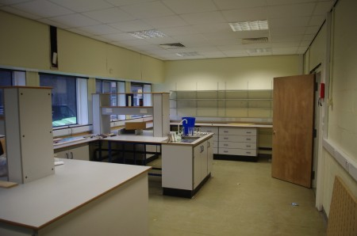
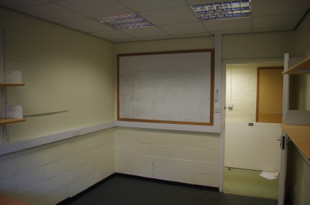

Some exciting news.. After around a year of searching and quite a bit of persistence Edinburgh Hacklab is moving to a new much bigger space at Summerhall. The former site of  University of Edinburgh Vet School, Summerhall is on the corner of The Meadows. Used extensively as a Festival venue in August, there is a year round program of events and exhibitions including the [Mini Maker Faire](http://makerfaireedinburgh.com/). We'll be neighbours with [Techcube](http://techcu.be) and expect to get to know some of the tenants.

We have the use of 3 rooms enabling some of the nosier and messy bits of equipment to have a space of their own and room for some dedicated project storage. As the photos show the rooms are much as they are when the university moved out so we have plenty of sinks (3 in total) and lots of sockets!

\[caption id="attachment\_1276" align="aligncenter" width="450"\] The main room - G1\[/caption\]

\[caption id="attachment\_1278" align="aligncenter" width="450"\] "The dirty room" - G2\[/caption\]

We are doing most of the moving this weekend so the first open night at Summerhall will be on Tuesday 22nd January from 7pm. Stay tuned over the coming weeks for further updates and events.

Thanks to all those involved, especially Mike and Al, in making this happen.

[More Photos](http://www.flickr.com/photos/greenhac/sets/72157632184156945/)
