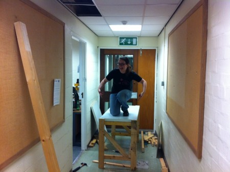
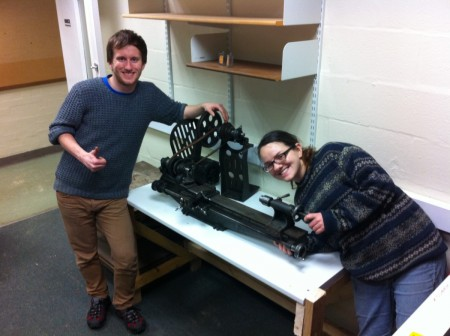
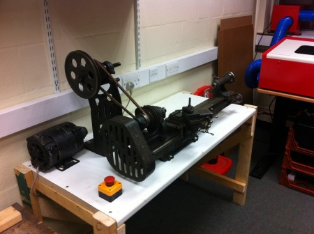

A nice Thursday evening was spent in our new Machine / Dirty room creating a very solid workbench for our antique metalworking lathe. We should have taken more photo's along the way but suffice to say we now have a solid platform to mount the Lathe and bring is back into full working order. Watch this space!

Big thanks to Tom, Grace and Tim who let me dance around and get carried away.

**UPDATE**

And here it is, mounted and complete the fat emergency stop button to prevent bad finger mash. The motor is still to be positioned correctly and fixed down.

