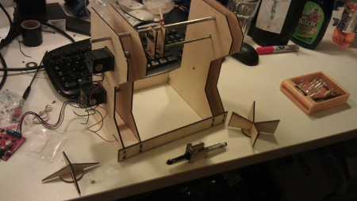
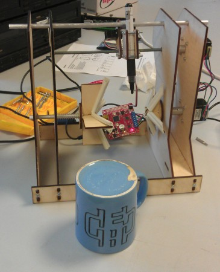

Someone at work broke my favourite mug. Well, the freebie mug I was using. Clearly I needed a new one, and the only logical solution was to build a machine to draw the image of my choice onto a blank mug.

[Evil Mad Scientist](http://egg-bot.com/) sell an egg bot kit - it draws a design onto an egg (or other broadly spherical object) using a couple of stepper motors, controlled through an Inkscape plugin. The control board is available separately (the whole project is open source), and is a fairly neat 2-stepper and single-servo controller, connecting to the host PC as a serial port over a USB cable. Hence most of the electronics and software were already taken care of, and I could concentrate on the hardware.

\[caption id="attachment\_1331" align="alignnone" width="450"\] The partially assembled machine\[/caption\]

<!--more-->The laser cutter provided most of the structural pieces. The mug is held between the two crosses - one is convex to hold the open end of the mug, and the other concave to hold the base. One end is attached to the first stepper while the other is just spring-loaded.  Some rubber draft-excluder tape provides some grip. In theory this arrangement is reasonably self-centering but in reality it takes a degree of adjustment to get it right, and the weight of the mug tends to pull it down.

The pen is held on a simple frame with a couple of nuts glued in place, which sit on a screw thread driven by the other stepper. The pen is held by a servo, lifting it clear of the mug when not drawing. The original idea was for the pen frame to slide on the upper rail, using a bit of aluminium tube as a cheap linear bearing, but it had a tendency to seize and ended up just resting against the side of the rail, with the weight of the pen and servo holding it in place.

As mentioned above, the board is controlled through an Inkscape plugin. This assumes that both steppers only turn through a maximum of 360 degrees, so a quick hack of the plugin was required - luckily it's written in Python. I found the line which generates the final coordinates to send to the board, and edited it so the second axis is multiplied by a constant. This has the neat advantage of not affecting the speed calculations, so the machine draws at roughly the same speed. It's probably worth moving the multiplyer into the options menu within Inkscape, since it'll need to be tweeked for different mug sizes.

\[caption id="attachment\_1332" align="alignnone" width="365"\] The completed mark I, with the first test print\[/caption\]

A mark II seems inevitable at this point, as there are a couple of areas that need some work. The first is the pen assembly, which is currently supported by the screw and only rests against the second guide rail. Ideally the weight should be taken by the guide rail, and given the lack of success with the aluminium tube it probably requires either a proper linear bearing or a couple of wheels to run against the rail. The screw thread is also attached directly to the stepper motor, and tends to wobble slightly; a better arrangement would be to support it on its own bearings and attach it to the stepper via a universal joint.

The other area needing some work is the mug mount - getting the mug centered takes a bit of effort and I suspect it's being dragged down by its own weight. There's also a strange stagger seen on what should be adjacent lines on the test jobs (visible on the E in the logo in the image above), which I suspect is the mug slipping in the grips. I have in mind something to grip the handle of the mug, and hence prevent it from slipping, but someone suggested a support which would go inside the mug and grip it from within, and that sounds too good to ignore.
