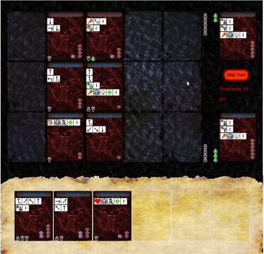
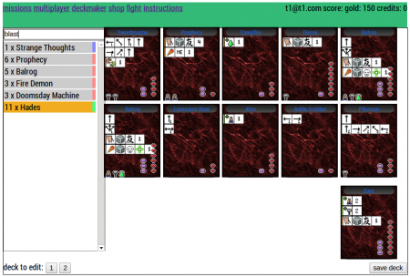

The loins of #makgammon ([make a game month](http://edinburghhacklab.com/2012/12/that-was-that-month-that-was-makgammon/)) are bearing fruit. [Runesketch](http://www.runesketch.com) the collectable card game is ready for alpha testers. When Runesketch was aired for #makgammon, common feedback was that the rules were incomprehensible, the multi player was hugely buggy to the point of being unplayable and generally it looked like a game that took a month to make (even though it was three months old!). It did not work on Firefox either which a lot of hacklabbers use, doh!

So in response the front end has been given a major facelift. We have added fight animations to make the rules a bit more self documenting, and added a tutorial to get people started with the rules. The game has an AI and some missions so multi player is not critical for playing the game. That said, multi player is the most fun. Hopefully some of the problems of multi player have been fixed, although you will probably need to coordinate with another players manually to ensure people are online to play. Its fun though! It also works on Firefox! (I don't think it works on safari though :(, we want it work work on iphone so that will be in the pipe at some point). Who cares about Internet Explorer. I assume it does not work on IE.

Just to recap the mechanics of what runesketch is in case you have not been following it religiously. You fight another wizard with your best 10 cards, which represent the product of a spell or something like that. So a major part is making a "deck", a set of 10 cards that fight well together:-

In a fight, the dualing wizards take turns playing cards (casting spells). What the cards actually do in a fight is down to the symbols on the card. Once the card is in play it is not interacted with. The wizards choices are only what cards to play and when, and what cards to bring to battle. Each wizard has a special commander card, and the aim is to kill that card, normally by getting your offensive cards to cross the table and attack it. Some cards are economy cards and generate faith, might or realisation. Most cards have an economic cost to them, if you can't pay the cost of a card you lose it, and one point of health is deducted from your commanders health. Thus, it is also possible to kill and enemy commander via economic shutdown.

The choice of cards going into battle is one of the most important choices to make in fighting. You can get more cards by winning battles, collecting booty and heading to the shop ... and so with better cards you can win more rewarding battles, to get cards faster.... and so that main game loop is born.

Hope you give [runesketch](http://www.runesketch.com) a whirl, and more importantly, send me your annoyances to tom.larkworthy@gmail.com

Tom Larkworthy & Tom Joyce
