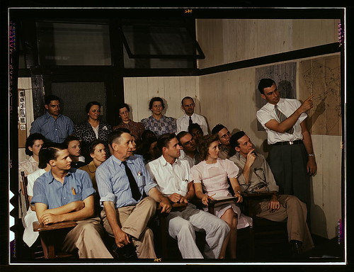

 by The Library of Congress, on Flickr")

 

Yes, it's that time of year when the Hacklab and tedium intersect in the Venn diagram region of the Annual General Meeting. The Open Night will therefore be slightly later than usual.

Members, be here at 7pm sharp. Visitors and guests, we plan to have the doors open to you at 9pm.
