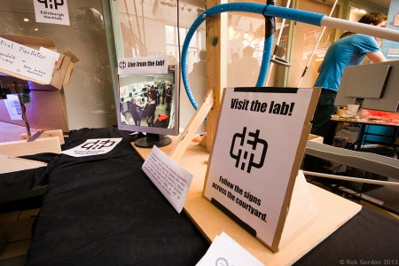

[Edinburgh Mini Maker Faire](http://makerfaireedinburgh.com/) took place last Sunday, at Summerhall. Hacklab being on site made it easy for us to get involved.

The centre piece of the lab's projects was a marble-run with a magnet-based lift belt, based on a previous version installed in the Forest. By Saturday evening the run was starting to take shape, but there was a lot still to be done. After "rapid prototyping" and trying out different ideas the run was completed and briefly tested just as the sun was rising.

As visitors started to arrived the marble run sprung into action. As with the previous version it had a tendency to drop ball bearings once in a while, so the area directly underneath was cordoned off and a "ball picker" equipped a magnet on a stick positioned to retrieve fallen balls. Occasionally a ball lacked speed to negotiate the loop in the run, resulting in a blockage that was again cleared with the help of a magnet.  Gandolf's Optical Pixalator and Andy's takeaway carton based Airship attracted attention and discussions with visitors. Peter wondering around with his LED Sombrero perched precariously on his head.

The hacklab was open for vistors and was almost full to capacity on a few occasions. Gary brought along many One Laptop Per Child machines for people to play with. Tom L also did some [musical CNC](http://www.youtube.com/watch?v=o7Zben7GJcA). Some familiar faces dropped by to say hi and a quite a few first time visitors were impressed and we expect to welcome them back on an [open night or to a workshop](http://edinburghhacklab.com/events/ "Events").

Thanks to everybody involved: those who worked on projects, the other exhibitors, Edinburgh Science Festival for doing organisation, and most importantly the visitors who came and made the day a great success. Bring on next year!

[Rob's Photos](http://www.flickr.com/photos/rjg_scotland/sets/72157633200982766/) [Peter's Photos](http://www.flickr.com/photos/greenhac/sets/72157633220839739/)

<iframe src="http://www.youtube.com/embed/G9CgQSduQO8" height="315" width="560" allowfullscreen frameborder="0"></iframe>
