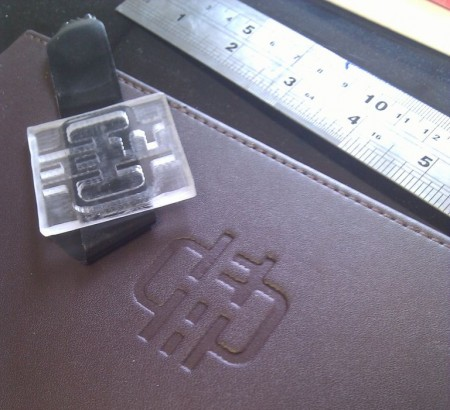

Marcel was busy over the weekend using the hacklab CNC mill to make some pretty cool embosing dice.

He has written an [Instructable](http://www.instructables.com/id/Embossing-letterpress/) describing the process.
