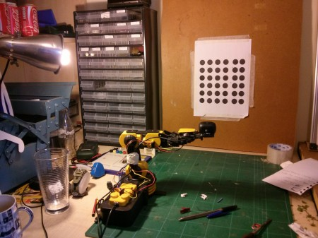
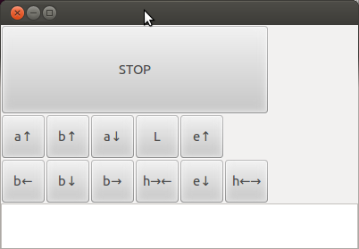
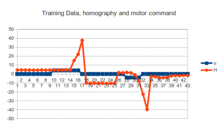
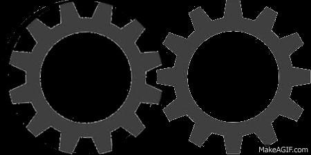
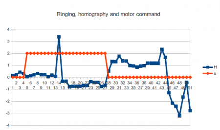
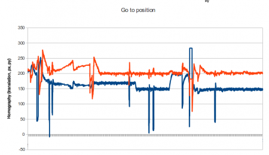
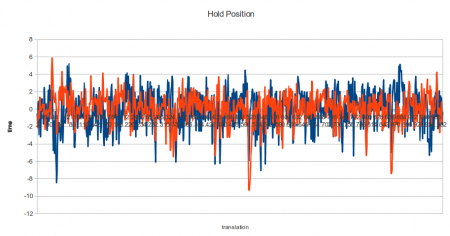

Our robot arm is learning to control itself from optical feedback alone! We connected the Lagadic's visual servoing platform (ViSP), OpenCVs robust homography estimator and University of Edinburgh's Locally Weighted Projection Regression (LWPR) adaptive control to create a software stack for a cheap USB robot arm toy and a webcam. The hardware cost about £48, and it took us 6 weekends to connect up cutting edge **open source** research software. Yes! All this software is free! It's been paid for already. I hope this article will guide people towards making use of these valuable public domain resources. We used an adaptive control scheme so at no point was robotic geometry measured, and instead the software \*learnt\* how to move the robot from experience alone.

<iframe width="420" height="315" src="http://www.youtube.com/embed/HP9GqcBbNs8" frameborder="0" allowfullscreen></iframe>

### Motivation

To recap ([here](http://edinburghhacklab.com/2012/05/optical-localization-to-0-1mm-no-problemo/) and [here](http://edinburghhacklab.com/2012/04/optical-localization-for-robot-arms-initial-experiments/)), our goal is to build high precision robot systems using cheap components, and now we have actually tried a control installation. The existing approach to precision machinery is to spend lots of money on precision steel components and more or less control the machine open loop (without feedback). CNCs are a good example of this where the lead screws are \*really\* expensive. This approach made sense when we did not have cheap methods of precision feedback, but now we have cheap cameras and cheap computation (thanks smart phones), an alternative method for obtaining precision could be to just to use dodgy mechanics and closed loop control (feedback). Visual feedback is particularly attractive because: its easy to install; it is contactless (so does not affect the motion of the thing you want to control) and it doesn't wear. With vision you can just slap markers on a mechanical part and off you go (with the appropriate software).

<!--more-->

### Previous work

We built a Lego bench top visual feedback test rig to see how accurate we could get visual feedback in [previous work](https://www.google.co.uk/url?sa=t&rct=j&q=&esrc=s&source=web&cd=1&cad=rja&ved=0CDIQFjAA&url=http%3A%2F%2Fedinburghhacklab.com%2F2012%2F05%2Foptical-localization-to-0-1mm-no-problemo%2F&ei=w-mHUanOHIfK0AW2v4GQAg&usg=AFQjCNGMd_phfPlPzRhNVtYAgeIEAvsszg&sig2=xX1Mr41rG1Xdx4PSWjsOfQ&bvm=bv.45960087,d.d2k "previous work"). We got accuracy to 0.1mm which was hard on the limit of our measurement accuracy. I think the system can achieve more than that but we don't have the equipment around to test in more detail.

We achieved high accuracy by using the visual servoing platform developed at Lagadic University (VISP). A grid of circles on a flat surface are tracked using a webcam. The software estimates the \*periphery\* of the circles by the intensity contrast. Thus, the estimation of a circle's centre is really the result of a calculation involving all edge pixels in the camera image (so there is redundancy). Furthermore, we are using a 10 x 10 grid of circles, so a lot of spatial information is fused over the entire image, so the accuracy of the results is much greater than the camera's accuracy on a single pixel. By using many redundant spatial features you end up with sub-pixel accuracy, and that is the main effect that gets us ridiculously good accuracy cheaply. Lagadic's software unique selling point is the extensive engineering on the specialised circle tracker (its fast). We used OpenCV to fuse the multiple estimations [robustly](http://en.wikipedia.org/wiki/Robust_statistics) through the [findHomography](http://docs.opencv.org/modules/calib3d/doc/camera_calibration_and_3d_reconstruction.html?highlight=findhomography#findhomography) method with RANSAC, which gives us the pose of the grid plane in the 3D world.

So with a high accuracy optical feedback mechanism prototyped, it was time to test its ability to control a real(ly crap) robot.

[](http://edinburghhacklab.com/wp-content/uploads/2013/05/2013-05-01-20.15.11.jpg)

### Low Level Control

We bought a robot from [maplin](\(http://www.maplin.co.uk/robotic-arm-kit-with-usb-pc-interface-266257?_$ja=kw:maplin+robotic+arm|cgn:Product%7c%7cEducational+products%7c%7cUsb+robotic+arm+kit%7c%7cA37jn|cgid:5107728029|tsid:45627|cn:Leisure%7c%7cProduct|cid:112182629|lid:38897211707|mt:Exact|nw:search|crid:20785758869&gclid=CIvayuX277YCFUfLtAodFDcA6A\)) that took USB input for £29.99. Using [PyUSB](http://sourceforge.net/apps/trac/pyusb/ "PyUSB") you can control it from Python fairly easily. One annoying detail is that by default you need sudo to access an arbitrary USB device. You can fix this by adding a rule to your udev rules. In a file `/etc/udev/rules.d/99-robot_arm.rules` put `SUBSYSTEM=="usb", ATTR{idVendor}=="1267", MODE="666"` and it should work (disconnect and reconnect the usb). If you use a different robot with a different usb chip, you can listen to dmesg when you plug in the device to discover the specific number for the idVendor field yourself.

The first thing we noticed is that the robot arm only can be switch on and off via usb. It does not have any proportional control. To use most control schemes its assumed an action is a vector or scalar value i.e. you can tell the system to move a joint at 50% speed or whatever. So our first programming task was

1\. turn the on-off control to a proportional control 2. make a GUI for the robot arm so we can drive it around manually.

To make proportional control you can simply turn the joint on and off really quickly ([pulse width modulation](http://en.wikipedia.org/wiki/Pulse-width_modulation)), and adjust the ratio of off to on per duty cycle. We implemented that as "SpeedControllor" in armcontrol.py. A naive implementation is pretty straightforward, but we found out later on the learning system worked better if all duty cycles completed before switching to a new speed. In addition, latency in the USB system meant an unpredictability in the usb commands had to be accounted for (as much as possible). Thus, our SpeedController's core functions got a little messy:-

```

    def _applySpeed(self, targetSpeed, step, fun, dev):
        targetSpeed = targetSpeed*self.speed_multipler
        if targetSpeed > 0 and targetSpeed > float(step)/self.steps:
            fun('cc', dev)
        elif targetSpeed < 0 and -targetSpeed > float(step)/self.steps:
            fun('cl', dev)    
        else:
            fun('', dev)

    def run(self):
        dev = usb.core.find(idVendor=0x1267, idProduct=0)

        while True :
            time_beginning = time.time() 

            if(self.step == 0): #only change speed on the beginning of a duty cycle
                baseSpeed = self.baseSpeed
                self.baseSpeed = 0

            if self.active:
                #apply proportional control
                self._applySpeed(baseSpeed, self.step, moveBase, dev)

            self.step = (self.step + 1) % self.steps

            time_end = time.time() 

            time_taken = time_end - time_beginning #estimate of time to send USB message
            time.sleep(max(0, self.sleep - time_taken)) #adjust for usb latency a bit
```

Building a GUI off the bat is important so you have a panic button to click when later the robot goes haywire (guaranteed). While this robot is not dangerous, its still horrible hearing the robot fight its own internal gearing, and also it can mess up an experiment if it manages to changes its dynamics but putting itself under internal strain. Having a GUI makes subsequent manoeuvring of the robot for later experiments a breeze, so its worthwhile investing in a decent user interface early on. I have been reusing the same python GUI (wxPython) I made for a 3D plotter a few years ago so it does not take long to customize a clone for new robots, you can find the code in `armcontrol.py`. I always `frame.SetWindowStyle( frame.GetWindowStyle()| wx.STAY_ON_TOP )` to make the GUI stay ontop of other GUI windows, so it's ALWAYS there in an emergency when the robot is switched on. I also use extended ASCII to get nice arrows without having to draw any images.

[](http://edinburghhacklab.com/wp-content/uploads/2013/04/gui.png)[](http://edinburghhacklab.com/wp-content/uploads/2013/05/2013-05-01-20.15.11.jpg)

With proportional control setup and a GUI, the low level motor control system is complete

### High Level Control

(you can skip this section and the next (Learning) if you don't want to learn any math)

The final component of the system is the connector between the optical feedback and the motor control system. Now, the tried and tested approach is model-based control, where you measure the moving parts and build a mathematical model of the system you are trying to control. You are looking to define the relationship between the feedback signals (in our case a homography matrix from findHomography() ) and the motor commands (a vector of joint commands). Its not usually that easy to formulate, in our case we would need the kinematic model of the arm e.g. how the elbow movements affect the end of the arm (trigonometry), plus the camera model (how the location of the grid pattern in 3D space + orientation is projected onto the 2D space of a camera images). We are too lazy to do the maths, and anyway, that system would only work if the mathematical model is correct. So we could not install that on a different robot without redoing all the sums again (very tedious).

Instead we went for the machine learning approach, i.e. an adaptive control system. In this style of control, a learning algorithm learns the statistical relationship between feedback and motor commands using a training set. We went one step further and used an \*online\* adaptive control which also continuously refines its model from every movement it ever makes. I had the good fortune of being taught robotics by Sethu Vijayakumar, one of the academics behind the state-of-the-art online adpative controllers, [LWPR](http://wcms.inf.ed.ac.uk/ipab/slmc/research/software-lwpr). The cool features about this algorithm is that it performs dimension reduction on the fly (so can do control even in high dimensional feedback systems), learns non-linear regression, and regularizes itself (so no over fitting) and manages it all in constant time per update! Its probably overkill for this project but I know the algorithm well so what the hell. Its also open source and has python bindings but does the heavy lifting in C++, ergo, it's fast as f\*\*\*.

We need some maths formalisms before we can pose the control problem ready for adaptive control. This is simple stuff, but masked in control specific nomenclature which can be a little hard to follow even if you are mathematician. The first important concept is that motor commands do different things depending on the pose of the robot. In general terms, we need a notation to denote the \*state\* of the system which is written **x** (the pose normally). The bold typeface indicates the variable is vector (a list of numbers) rather than a scalar (a single number). **x** in our system would represent the joint angles of the robot arm. Clearly moving the elbow joint when the arm is fully extended has a different effect on the end position than when the arm is retracted. Thus the current state, **x**, is critical to control.

To control something we wish to get its state, **x**, to some desired state, using actions. Actions we denote as **u**, which again is a vector quantity (we can move many joints at the same time all at different speeds). Applying an action changes the state smoothly at some rate (we assume the system is continuously differentiable which why we can control it and also why we need proportional control to get the formalisms to work). As control is centred around controlling things in the time domain, rather than write dx/dt as the rate of state change with respect to time, we write **ẋ**. So if our state **x** is positions, **ẋ** is velocities (in joint space). We don't actually know how the actions are going to change the state over time, so we represent the system under control as a black box function f. Putting it all together the basic control formalism is:-

```
ẋ = f(x, u)

```

f is unknown so in adaptive control we want to learn that from examples. In our system we also can't measure the joint angles directly, so we use the homography matrix as **x** instead. This does not pose a problem, as the problem formulation is very general and independent of coordinate system. So we just control the arm in homography space rather than joint space i.e. we tell the robot where we would like it to observe the grid pattern and it tries to reposition the camera to accomidate.

Now we have the formulation of the dynamics of the arm, to control it, we have to choose a motor command **u** to move the arm towards the desired state. There is rich literature in control relating to the fact that moving the system as fast as possible might not be the optimal policy, because you will might pickup a large velocity and overshoot. If we are considering velocity we might change the formulation to include acceleration, but regardless optimal control tends to have to consider a series of motor commands a number of time steps into the future, perhaps solving the equations using [dynamic programming](http://en.wikipedia.org/wiki/Dynamic_programming). We don't do this for simplicity, but also as you will see in the experiment section there were mechanical issues that prevented us doing this anyway. Our solution for control simply involved choosing a motor command that minimized the distance between where we were and where we wanted to go. This is normally expressed as a cost function J, which we want to minimize.

```
J(x,u) = f(x,u)-(x_desired - x)

u = min_u(J(x,u))

```

Here x-x\_desired reflects the error in state, and f(x,u) the change in state for a particular motor command. We pick the motor command that moves the state towards no error. The reason for expressing it as explicit cost function is that it is useful to tweak J to accommodate different behaviours such as minimizing energy (we do this later to avoid some undesirable effects), whilst still keeping the same optimization framework. We just use an off-the-shelf optimizer to actually solve the equation (don't try and write your own)

## Learning

Central to control is the dynamics of the system (a.k.a the plant), f(x,u). In adaptive control we learn it rather than try to write it down explicitly. Regression is the statistical technique of relating one set of variables to another, y\_r = g(x\_r). To turn estimating the plant into a regression problem we just concatenate the motor commands with the state variable, x\_r = \[x, u\] and try to fit a curve to y\_r = **ẋ**.

LWPR is fed lots of examples of the above. You can represent a training set (lots of individual observations) in matrix form by stacking the individual vectors so the regression problem is succinctly represented as

```
Ytrain = g(Xtrain)

```

Once g has been estimated through regression, you can test its performance on held back data set be seeing the difference between what it predicts, and what was actually observed for real (called [cross validation](http://en.wikipedia.org/wiki/Cross-validation_\(statistics\)))

```
error = Y-g(X)

```

The above equation is not collapsing the error into a single scalar value, so commonly people will take the [root mean squared error](http://en.wikipedia.org/wiki/Root-mean-square_deviation) over the above. Low is a good fit. I have glossed over a few details like data normalization, but the [pragmatic documentation](http://wcms.inf.ed.ac.uk/ipab/slmc/research/lwpr/lwpr-doc.pdf) that accompanies LWPR is very good at explaining how do everything, so read that for the full approach. Roughly, we twiddle all of LWPRs parameters to minimise the cross-validation error after learning on training data.

To gather data for the training set we just randomly moved the robot arm around. Initially by hand, but then later by a program that just generated random control vectors. With the robot arm randomly moving it tended to hit the floor fairly quickly so we had to add a safety feature that if the grid pattern was going out of view, specific joints moved it back into the centre of the screen. Although the full homography matrix is hard to interpret by eye roughly speaking the righthand side is the offset coordinates which you can condition upon easily.

So once you have built a training set, chosen meta-parameters for LWPR, fitted g(), and tested it does indeed predict well on held out data, you are left with a function that takes state + motor commands \[**x**, **u**\] and predicts the state change, **ẋ**. To use that in the control framework, at a given point in time, you know the current state, **x**, and you vary the motor commands in order to minimize the cost function, J (above) i.e. you picking a good **u** to move your state in the right direction. With LWPR every iteration you can also re-estiamte g() with new data as it comes in, although its not necessary in early stages of development (online learning).

Tada, now your robot arm is under control! Well that's the theory anyway, but in practice there are a whole load of issues not accounted for!

### Setup 1

[](http://edinburghhacklab.com/wp-content/uploads/2013/05/2013-05-01-20.15.11.jpg)

The initial system reads optical feedback as fast as possible (30fps) which is provided as a homography matrix, and the optimizes what to do next. The camera is fitted on the arm, and the gird of dots is static.

Our initial control loop sketch looked like

```
loop(x_desired)
   x = read_homography()
   u = optimize_u(x, x_desired) or random()
   apply_motor_commands(u)
   dx = (read_homography() - x)
   #for online adaptation or building training set
   regression_datum = (x,u),dx 

```

Its worth noting that you want training set data collection, and the application of learnt control should to share as much common code as possible. You want to avoid collecting data in a different control loop because the statistics you learn won't apply in a new software context. Thus, our loop had switches to decide whether we were generating random control vectors or applying optimizations, as well as whether we were saving data to file or applying online adaptation (or neither, or both).

After we generated a training set and then fitted the data with LWPR and applied it, we got terrible performance! The robot just did a nose dive into the ground, it did not seem to have learnt anything sensible. To find out why we have to dig into the data a little deeper. It had problems for a number of reasons and I will outline each below.

#### Slow

Before we actually got to control the robot we had problems with how fast we could solve the control optimization (the min\_u(J(x,u)) bit). By using an off the shelf optimizer we could swap algorithms easily, here is our final code:

```
#u = (self.cost_position, action, maxiter=1000, maxfun=10000)
#u = fmin_bfgs(f=self.cost_position, x0=action, gtol=0.1, epsilon=0.001)
#u = fmin_ncg(f=self.cost_position, fprime=None, x0=action, epsilon=0.001)
(u, nfeval, rc) = fmin_tnc(self.cost_position, approx_grad=True, fprime=None, x0=action, epsilon=0.001)

```

As you can see we tried 4 different numerical optimizing routines from scipy before we found one that was blazing fast (tnc, written in C with a python wrapper). We further improved performance by feeding the previous answer to the optimization as the initial condition for the next time step.

#### Latency

The main reason it did not learn anything was to do with how the problem was posed. Using a spreadsheet of the training data you can quickly look at the correlations between variables on a scatter plot or time series. Below is the time series of one of the motor command elements and a variable that happened to be correlated with it:-

[](http://edinburghhacklab.com/wp-content/uploads/2013/04/latency.png)

What you see is that the state responds to the motor command 3 - 5 states after the motor command is applied. As we are performing regression immediately, the learner has been given an impossible function to learn, and it just learns the mean value of nothing. At time step 10 the learner would be trying to learn that an a positive u has no effect on state. Note that in this example the most extreme values of the states (17,33) lie where motor command has returned to zero!

Latency is a massive problem in control, because it defines a theoretic limit to how fast you can control the system. To control a system fast you either need to be able to predict the system very accurately, or integrate feedback very fast. We are using cheap hardware, so prediction of the system is not going to be great, thus we want our control loop fast. Even worse, this diagram has variable latency which is actually another (unpleasant) phenomena going on.

#### Partial Observability

Only one of the motor commands exhibited variable latency which was the swivel joint at the base of the robot. The reason was [backlash](http://en.wikipedia.org/wiki/Backlash_\(engineering\)). Backlash is caused by slack in the mechanical system, often in the gearing: [](http://edinburghhacklab.com/wp-content/uploads/2013/04/backlash.gif)

What happens is that when the base swivel joint changes direction, an extra distance has to be traversed before the gearing re-engages. This manifests itself as the motor command taking a longer time to affect the state variables. The reason why this doesn't happen with the other joints is they are under force in a consistent direction due to gravity, thus the gears are always engaged on one side (called preloading).

As the effect of a motor command now depends on the state of the gearing, which we don't have a measurement for, we call this a partially observable problem and it can be accounted for but with added algorithmic complexity (LWPR can't handle it out of the box). In our case it would be easier to add a spring to the base and preload the join mechanically. But seeing as this is just exploratory experimentation we just abandoned trying to control the base joint.

#### Noise

The next revealing problem became evident when tracking the behaviour of the homography matrix after ceasing application of a non-zero motor command:-

[](http://edinburghhacklab.com/wp-content/uploads/2013/04/ringing.png)

What you see is instability on the homography when the arm starts moving, and a wave like overtures to the homography over time. Basically, moving shakes the camera alot, whcih can change the values of the homography drastically, and it takes a little while to settle down. The wave pattern is the vibrations in the arm, although the homograph maths projects that into a weird space which is harder to visualise with a 2D plot. So even if we ignore the latency problem, the camera shakes inject a hell of a lot of noise into the system which will give the regression a hard time. Time to regroup.

### Setup 2

To account for latency and instability in the feedback we choose to wait for three consecutive readings of the homography before deciding what applying a given motor commmand did. The new method was:-

```
loop(x_desired)
   x = read_homography()
   u = optimize_u(x, x_desired) or random()
   apply_motor_commands(u)
   wait_for min_latency() #take up the slack
   dx = (wait_for_stable_homography() - x) #could take a while
   #for online adaptation or building training set
   regression_datum = (x,u),dx 

```

A big drawback of this approach is that now we can only control the arm in discrete steps, and we don't really know how long wait\_for\_stable\_homography() will take to settle, but it does lead to much cleaner data and therefore an easier problem.

### Adaptive control

It took a little while to successfully learn the data set, the LWPR documentation helped enormously, eventually we were able to get a reasonable setting for all the parameters and could turn on online adaptive control (i.e. reestimating f as we went along).

In early runs the optimization would choose massive motor commands and would try to hammer the robot arm into the ground at maximum speed (I said haywire behaviour was guaranteed). Good job we have an emergency button. The problem stemmed from the fact that sometimes the partially learnt dynamics would suggests all directions did not improve the cost function, so any motor command the optimizer would consider as bad. Due to the local nature of LWPR, a massive motor command lies outside the explored space and so it predicts 0 for large **u**. 0 is naively a better choice as far as the optimizer is concerned, so that is what it was picking. To stop massive motor commands we had to tailor the cost function slightly to include a tunable penalty term:

```
J(x,u) = f(x,u)-(x_desired - x) + k*u^2

```

For large **u** the penulty term rises quadratically and makes large **u**s undesirable to the optimizer.

That solved our final problem and the adaptive control could be turned on and the robot leaned! At that point the robot started to act \*really\* cool.

When you think about it, our training set is of consecutive readings taken from a single trajectory the robot arm took during random movements. We flattened homography into an 8 dim state vector (I would flatten it to a 6 dim one given my time again), so from a random initialisation, the probability that the initial state is anywhere near where the collected training data is quite low. The trajectory the training data traced in 8 dimensional space is pretty much far away from everywhere because an 8 dimensional space scales aggressively compared to line features (see the [curse of dimensionality](http://en.wikipedia.org/wiki/Curse_of_dimensionality)). This meant the robot hadn't got a good estimate of its dynamics in the vicinity of its starting location.

When the robot is switch on with adaptive control, it does a very bad job at controlling itself at first. Then, the robot seems to pause to think, and then starts going in the right direction.

The fact the robot pauses for thought is a real effect. The control routine is an optimization problem seeded with the previous step's answer, so when the robot updates its dynamics drastically, the iterative optimization routine has to do more iterations before finding the optimal solution. Thus, learning some thing drastically new like the cost gradient is in the opposite direction than previously thought really does make the loop slow down the process the new optimal move to make. Very cool! Its alive! After learning the new direction to move the robot tends to then overshoot its target and does another pause before reversing direction. This ringing settles down over time as it learns its space properly and it does a pretty good job at keeping the homograph values where it is aiming.

### Results

Here is a ability of the robot to track a position after learning for an hour or so. We just display the translation components of the homography as they are easier to understand:

[](http://edinburghhacklab.com/wp-content/uploads/2013/05/control_large_view.png)

You can clearly see the changes in position as we commanded the robot around (this data was collected during Edinburgh [mini-Makerfaire](http://makerfaireedinburgh.com/)). However, you can also see massive spasms which we think is the proportional control having a pause during pulse width modulation (or the usb bus acting up and blocking the PWM loop). Some of them might be children attacking the experiment too, Makerfaire is a hostile environment for robots :p

Zooming in to one of the steady spikeless portions we can measure the real accuracy of the the arm. The mean is subtracted so we can see the behaviour of both coordinates around a mean of zero. [](http://edinburghhacklab.com/wp-content/uploads/2013/05/control_zoom_view.png)

The standard deviations were 2.09 and 1.74 in pixel units. 1 pixel translation equated to 0.5mm in real space. Using the rough estimate that 95% of samples lie [between 2 sigmas from the mean](http://en.wikipedia.org/wiki/1.96), we can say that 95% of the time our arm was within 2mm of its target. That's not particularly impressive precision but its something we can build upon.

### Conclusion

The performance was not the 0.1mm accuracy hoped for, but the software stack is doing what it can given the limited hardware. The hardware has a number of unpleasant features that make control difficult, wild unpredictability on the motor commands, vibrations that rock the camera, delays between the action and the effect on feedback and backlash/partial observability problems. Yet despite these challenges, the software does a good a job under those severe constraints. A nice feature of this software stack is that it is all the control is in feedback space and we never had to write down the motion equations of the robot arm, thus this software could be run on a quite a different robot with minimal changes. So how can we improve?

First, we need to reduce all the unpredictability, particularly in the low level PWM control. The USB bus should not be doing real time control of high frequency loops. The proportional control should delegated to an embedded system with reliable timings instead (e.g. an Arduino).

Second, the shakyness of the camera forces us to control in discrete steps. This is horrible. With a trajectory planner we could try to achieve reduction in error with smooth accelerations (no sudden movements and hopefully stabler homography feedback). It would be hugely preferable to continuously move the arm around whilst integrating optical feedback on the fly, however, we would have to tackle the latency issue as well. I do think camera latency might be a common issue so we should definitely try to tackle that in our next iteration.

A lot of our problems come from the hardware itself, such as backlash and general susceptibility to vibrations. A stiffer platform could solve many of these issues. Backlash is not an expensive problem to solve (put springs everywhere and preload), so demanding a low backlash system for control is not in direct opposition to cheap precision, but it is something that needs to be thought of before choosing a platform.

We are very pleased with the vision system though. Its written in C++ and did not segment fault during the several hours of running during Makerfaire. Shame its a pig to compile :( The next step for us is to abandon the robot arm (its too crap even for our skills), and try repeating these experiments on a stiffer platform (our homebrew CNC at the lab, [its currently used to play music](http://www.youtube.com/watch?v=o7Zben7GJcA)).

Thanks for reading!!!! code is on [Github](https://github.com/tomlarkworthy/USB-robot-arm)

Tom Larkworthy and Tom Joyce (mainly worked on [Runesketch](http://runesketch.com) but was of considerable moral support)
