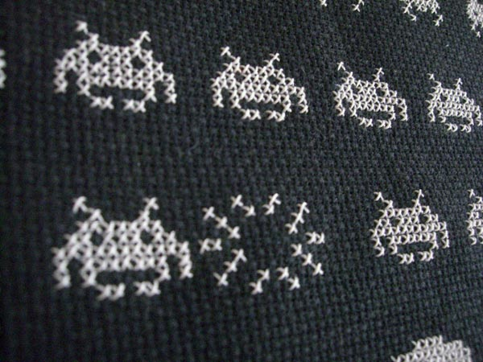

\[caption id="" align="alignright" width="360"\] Photo Create Commons [cross\_stitch\_ninja](http://www.flickr.com/photos/cross_stitch_ninja/)\[/caption\]

The Hacklab will be running the first Open Craft night on Wednesday 19th June.

If you have a project that is craft focused such as using fabric, yarn, paper or card or you have some skills in those sort of areas come along. If you don't have either yet and are just curious then your very welcome too...

I've got a project to dye some some natural color Ikea cushion covers red or make an outer cover out of red fabric. There are also plans afoot to weave a barcode using only wool and drinking straws.

The lab will be open from 7:30pm, [Directions](http://edinburghhacklab.com/visit/ "Visit us")

See you there!
