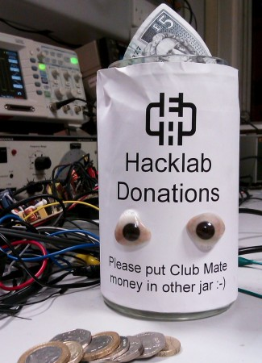

Until January 2013 the Hacklab was located at the Out of the Blue studios on Dalmeny St. We outgrew this space to the point that we weren't able to admit any more members. Since taking the plunge and moving into the much bigger and better space at Summerhall, the Hacklab has been busier and membership is steadily growing. However, rent is around 3 times more than for the previous space, and we are currently running at a deficit of ~£300/month. As planned the reserve built up whilst at OOTB is being used to see us through the period whilst we grow. Our calculations suggest the reserve will take us to September (possibly further if we keep growing), but we are asking for some help now to head off a crisis...

So what can you do to help?

Firstly, if you regularly come to the lab or think it would be useful to you, and you're able to commit £25/month or more, then [become a](http://edinburghhacklab.com/join/ "Join") [member](http://edinburghhacklab.com/join/ "Join")! You get some unique benefits such as 24/7 access and a storage box to leave projects at the lab.

If live some distance away or don't have much time to get to the lab, membership may not be as attractive. You can still support the lab by becoming a Friend (not a Facebook "friend", a real friend!) by making a monthly donation. £5-10/month would be ideal- or to put it another way, that's 2 or 3 pints at the pub... your liver will thank you too.

[Donate Now!](http://edinburghhacklab.com/donate/ "Donate")

Something we would like to stress is that coming along to open nights or dropping by the lab when a member is present will always be free of charge. But this can obviously continue only if the lab can pay the rent, so dropping any spare cash in the donations jar is most excellent.

Please help get the word out about the lab to the people of Edinburgh. Tell your friends, [Tweet about us](https://twitter.com/intent/tweet?url=http://edinburghhacklab.com/2013/06/hacklab-needs-your-support/&text=Edinburgh%20Hacklab%20needs%20your%20help:), [share on Facebook](https://www.facebook.com/edinburghhacklab)

Workshops generate income for the hacklab so why not sign up for the last few remaining places on our [Ardunio workshop](http://edinarduino-july-2013-ws.eventbrite.co.uk).

Thank you for your support!
