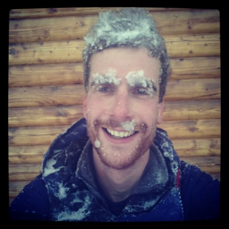
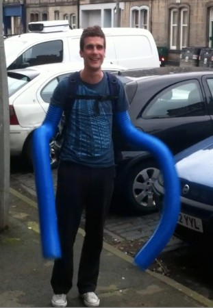

\[caption id="attachment\_1541" align="alignright" width="288"\] John in Chamonix\[/caption\]

As some of you may have heard already, our member and friend John Lamb died recently in a skiing accident. John had spent the winter in Chamonix and was an accomplished skier and snowboarder, sadly John's accident was caused by bad weather and bad luck. On behalf of Edinburgh Hacklab I think it's fair to say we're all shocked and gutted by the news.

John was one of the first to join the lab once it started. I knew John through Twitter but met him for the first time at the lab's opening party. John joined the lab and quickly became an integral part of the organisation. He tended to dive straight into things and, like the best geeks, was quick to pick up new skills and learn new things.

\[caption id="attachment\_1560" align="alignleft" width="311"\] Robo-Laser-John with laser cutter exhaust tubes\[/caption\]

John was instrumental in the lab's laser cutter purchase. He researched cutters and, along with other members, put up money to enable us to buy the cutter. He travelled with Gareth to pick it up and bring it home. For this he earned the nickname "Laser John".Laser John and cutter seemed inseparable and he spent much time designing and lasering projects, and managed to work out the intricacies of the crappy Chinese software.

John embodied the "hacker spirit" wonderfully, passionately researching problems and crafting amazing solutions. He didn't fear challenge and he didn't think small, his project ideas were always big. Once he put his mind to something, he'd go for it. He decided he wanted a scarf, so he learned to knit and within a couple of weeks had a ridiculously long scarf. He wanted a way to film himself snowboarding and so he planned an elaborate scheme to have a quadcopter with camera follow him around. His can- and will-do attitude was an inspiration to all of us.

In addition to his projects he was also a central part of the Hacklab social life and became a great friend to many members. I will remember happy times at Hacklab nights out or going to gigs and discussing crazy schemes over a pint or three.

Despite his affinity for the laser cutter, I think his Hacklab tool of choice was the claw-hammer, affectionately known as "sudo". I remember how when John was having trouble with a project he would apply a gentle tap from sudo, which usually (permanently) resolved the problem.

For me, and I think other Hacklab members and friends, this is how I'll remember John. He brought fun to the lab, when John was around I was usually chuckling.

John's funeral has been arranged for this Friday, the 7th of June. John's family would like as many as possible of John's friends and Hacklab-related folk to come along. The service is at Warriston Crematorium at 14:00, if you're planning to attend, please [add yourself to this Doodle poll](http://www.doodle.com/havzuh9gngbmar5x) so we can send an indication of numbers to John's family.

Al, on belhalf of Edinburgh Hacklab.

p.s., I'll leave you with this:

<iframe src="http://www.youtube.com/embed/QQ4sKJW-6M8" height="345" width="560" allowfullscreen frameborder="0"></iframe>
