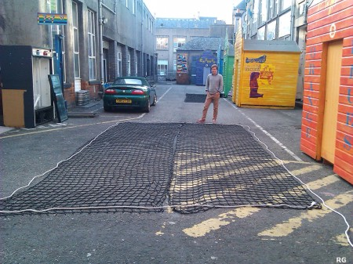
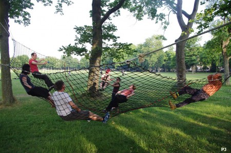

As soon as Bart got hands on an old fall arrest net, he knew exactly what he was going to do with it. Really there was only one thing that just had to be done - turn it into a giant hammock! In its original 20x2 metre length it was hardly suitable though, so some modification was required. The net was cut into three lenths, then, two of the lengths were stitched side by side using paracord. The thick rope that ran the circumference of the net was re-attached and anchor points created.

\[caption id="attachment\_1692" align="aligncenter" width="450"\] The cut net\[/caption\]

The new hammock was finally put to the test on Bart's birthday. It was a hot, sunny evening in the Meadows; perfect weather for a BBQ and hanging around in the hammock with some great people, beer and music. The net and fixings mostly held strong and at one point we had fifteen people on it at once. A low quality ratchet strap failed, causing some people to be unexpectedly reunited with the ground at one corner of the net, but once replaced it held strong and provided a great source of amusement to passers by. Future modifications could include adding the third remaining section of net to make an even larger hammock!

\[caption id="attachment\_1693" align="aligncenter" width="450"\] Hanging around in the Meadows\[/caption\]

[Photos by Pete](http://www.flickr.com/photos/greenhac/sets/72157634628776949/ "Photos by Pete") [Photos by Rob](http://www.flickr.com/photos/rjg_scotland/sets/72157634629272643/ "Photos by Rob")
